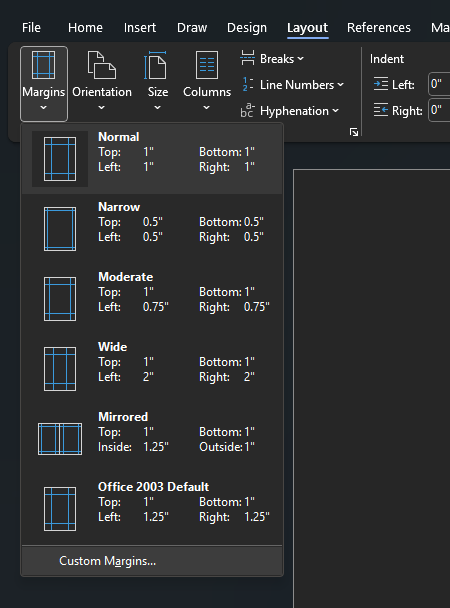
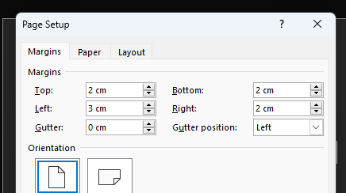
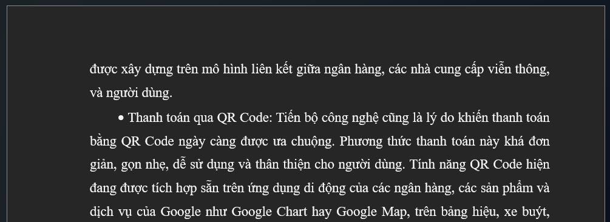
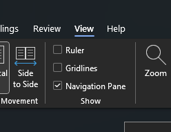
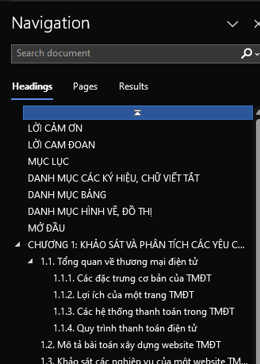
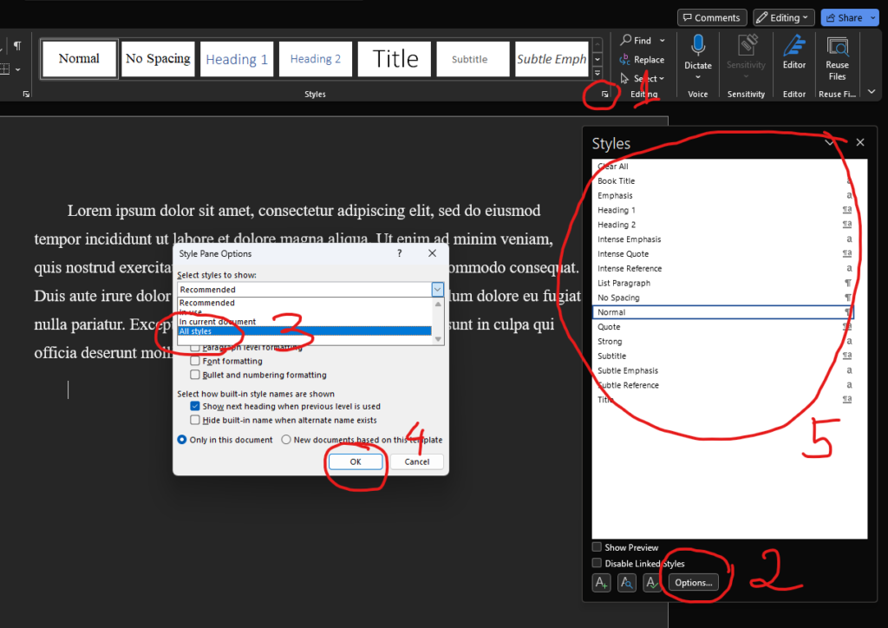
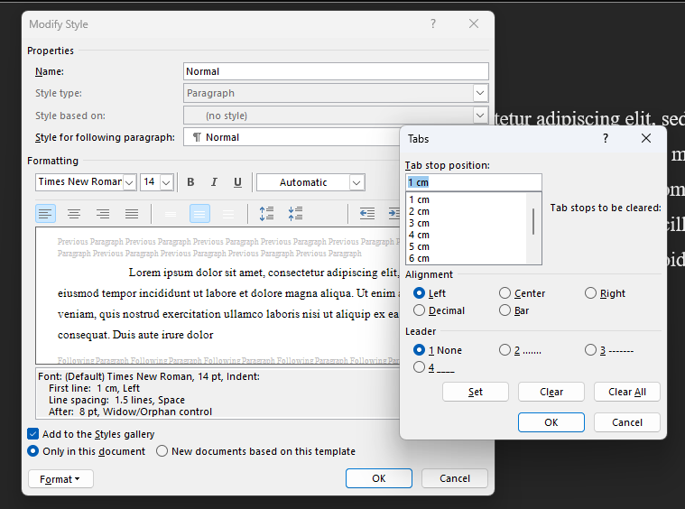
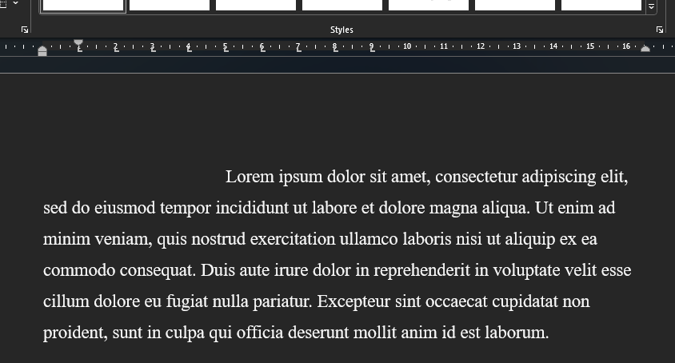

Xin chào các bạn! Mình là Sang, một sinh viên bình thường đang theo học tại Học viện Kỹ thuật mật mã. Mới đây mình vừa hoàn thành đồ án tốt nghiệp tại trường. Qua 3 tuần làm báo cáo đồ án mình cũng đã tích lũy được chút kinh nghiệm muốn chia sẻ cho các bạn cũng như các em chuẩn bị làm báo cáo đồ án tốt nghiệp trên Microsoft Word sao cho hiệu quả nhé!

## Chuyển từ đơn vị inch -> cm

Mặc định Microsoft Word sử dụng đơn vị inch, nhưng người Việt Nam lại sử dụng đơn vị cm cơ. Do đó ta cần chuyển đơn vị inch sang cm. Để chuyển đơn vị thì ta làm theo các bước sau:

* Vào mục **File -> Options -> Advanced**.
* Lăn chuột xuống mục **Display**.
* Chọn đơn vị trong mục **Show measurements in units of**.
* Chọn **OK**.

## Margin

Tiếp theo cần phải cài đặt margin cho báo cáo, margin là khoảng cách từ nội dung đến rìa giấy. Ở Học viện thì chúng mình được yêu cầu để margin là **(2cm, 2cm, 2cm, 3cm) (top, right, bottom, left)**. Margin có thể khác nhau tùy theo yêu cầu của từng trường.

Bạn có thể cài đặt margin trong mục **Layout -> Margins (bên tay trái) -> Custom Margins**.

## Paragraph

Đoạn văn là kiểu văn bản thường được sử dụng nhiều nhất trong báo cáo. Ví dụ theo quy định của học viện thì như sau:

* Cỡ chữ: 14 (pt).
* Font chữ: Times New Roman.
* Dãn dòng (line spacing): 1.5 lines.
* Dòng đầu tiên thụt đầu dòng 1cm.

Để áp dụng các yêu cầu trên ta cần làm theo các bước sau:

Chuột phải vào style **Normal** trên thanh **Styles** và chọn **Modify**.

Một popup sẽ hiện lên. Ta cài đặt font chữ và cỡ chữ ở đây.

Ở nút **Format** ở góc dưới bên trái. Chọn **Paragraph** để cài đặt thụt đầu dòng 1cm (khoanh màu đỏ) và dãn dòng (khoanh màu xanh).

Kết quả:

## Heading

Heading là các thanh tiêu đề của báo cáo, trong Microsoft Word hỗ trợ từ Heading 1 -> Heading 9. Sử dụng heading sẽ giúp cho tiêu đề lớn có thể hiển thị ở thanh **Navigation Pane**.

Để bật thanh **Navigation Pane** ta vào mục **View** và check vào **Navigation Pane** ở thanh công cụ.

Ví dụ:

* Tiêu đề 1 (heading 1) in đậm, canh giữa.
* Tiêu đề 2 (heading 2) in đậm, canh lề trái.
* Tiêu đề 3 (heading 3) in nhạt, nghiên, thụt đầu dòng 1cm.
* Tiêu đề 4 (heading 4) in nhạt, nghiên, thụt đầu dòng 1cm.

Với heading 1 và heading 2 thì bạn có thể chỉnh sửa bằng cách làm tương tự **Paragraph**, trên thanh **Styles** chuột phải vào **Heading 1** và **Heading 2** và chọn **Modify**.

Vậy còn **Heading 3** và **Heading 4** không hiển thị trên thanh Styles thì sao? Bạn có thể làm theo các bước sau đây để hiển thị toàn bộ styles:

## Tab stop

Tab stop là vị trí mà con trỏ sẽ chạy đến khi ta nhấn tab. Tùy theo vị trí của con trỏ mà khi nhấn tab nó sẽ chạy đến vị trí tab stop gần nhất.

Ta có thể cài đặt tab stop cho bất kỳ kiểu style nào bằng cách chuột phải vào style và chọn **Modify -> Format -> Tabs** và cài đặt vị trí tab stop. Bên dưới là ví dụ mình muốn mỗi lần mình nhấn tab là con trỏ sẽ chạy đến các vị trí **1cm, 2cm, 3cm**,…

Đây là kết quả, khi mình nhấn tab thì con trỏ để đẩy đến vị trí tab stop mà mình đã cài đặt:

Ngoài ra, để có thể hiển thị thanh ruler bên trên, từ top navigation ta vào mục **View** -> chọn **Ruler**.

Vậy là đã kết thúc phần 1. Phần 2 các bạn có thể đọc tại đây: Hướng dẫn trình bày báo cáo đồ án tốt nghiệp trên Word (phần 2).
