## 1. Chain of Responsibility
>
> Cho phép chúng ta xử lý sự kiện bằng một hoặc nhiều Handler

Chain of Responsibility Pattern hoạt động dựa vào việc chuyển đổi **đối tượng tiếp nhận event** thành các **đối tượng độc lập** là các **handler**. Các handler sẽ được link với nhau thành một chuỗi các handler liên tiếp nhau. Khi một request (hoặc event) được gửi tới thì request đó sẽ được chuyển đi liên tiếp trong chuỗi handler cho tới khi gặp một handler có thể xử lý request đó. Mỗi handler đều có quyền quyết định rằng nó sẽ xử lý Request hoặc chuyển tiếp Request đó sang handler tiếp theo.

Chain of Responsibility tách nhỏ một request của người gửi, bằng việc tạo ra nhiều object để handle request đó. Giả sử bạn có 1 một request cần xử lý với nhiều logic. Nếu sử dung *if..else* quá nhiều thì sẽ quá phức tạp và khó refactor sau này. Vậy nên Chain of responsibility Pattern tạo ra 1 chuổi các handle. Mỗi handle xử lý một logic khác nhau và với một điệu kiện cụ thể nào đó. Nói cụ thể hơn thì Chain of responsibility dùng để tránh sự liên kết trực tiếp giữa đối tượng gửi request và đối tượng nhận request khi request đó có thể được xử lý bởi hơn 1 đối tượng.

### 1.1. Chain of Responsibility được sử dụng khi nào?

- Có nhiều hơn 1 đối tượng có thể xử lý request đó, nhưng đối tượng cụ thể nào thực hiện request đó lại phụ thuộc vào ngữ cảnh
- Khi có nhiều cách thức để xử lý cho cùng một yêu cầu được gửi tới
- Khi không muốn xác định rõ ràng cách thức xử lý một sự kiện được gửi tới
- Khi muốn đưa ra yêu cầu cho một trong nhiều đối tượng mà không chỉ định rõ ràng tượng nào sẽ nhận và xử lý yêu cầu
- Tập các đối tượng xử lí là tập các đối tượng độc lập và có khả năng biến đổi

### 1.2. Cấu trúc

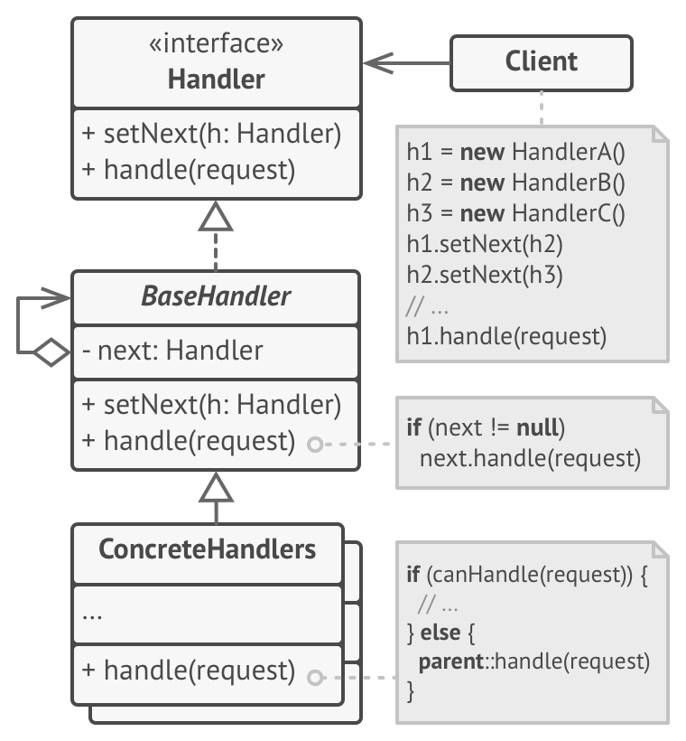

Các thành phần tham gia vào Chain of Responsibility Pattern:

- **Client**: Nơi tạo ra các đối tượng handler và sử dụng chúng
- **Handler**: Interface tạo xương sống cho các handler.
- **BaseHandler**: (Tùy chọn) Nơi nhận request đầu tiên (handler đầu tiên). Bạn có thể không cần class này và có thể chỉ định một handler khác nhận request đầu tiên
- **ConcreteHandlers**: Các next handler

### 1.3. Thực hành

- Khai báo xương sống Handler

```js
interface Handler {
    setNext(handler: Handler): void;
    handle(request: Request): any;
}
```

- Tạo BaseHandler triển khai từ Handler (là nơi nhận request đầu tiên)

```js
class BaseHandler implements Handler {
    protected next?: Handler;
    init(next?: Handler) {
        this.next = next
    }
    setNext(handler?: Handler) : void {
        this.next = handler
    }
    handle(request: Request) : any {
        if(this.next!=null)
            return this.next.handle(request);
    }
}
```

- Tạo các cấu trúc cho các handler phía sau

```js
class ConcreteHandler extends BaseHandler {
    protected next?: Handler;
    init(next?: Handler) {
        this.next = next
    }
    setNext(handler?: Handler) : void {
        this.next = handler
    }
    handle(request: Request) : any {
        if(this.canHandle(request)) {
            // Code here
        } else {
            if(this.next!=null)
                return this.next.handle(request);
        }
    }
    canHandle(request: any) : boolean {
        // return True or False
    }
}
```

- Client tạo và sử dụng các handler

```js
class Client {
    sendRequest() {
        let thirdHandler = new ConcreteHandler(null);
        let secondHandler = new ConcreteHandler(thirdHandler);
        let firstHandler = new ConcreteHandler(secondHandler);
        let request = new Request();
        firstHandler.handle(request);
    }
}
```

## 2. Command
>
> Command Pattern (còn gọi là Action Pattern hoặc Transaction Pattern) tạo ra một đối tượng có thể triển khai một phương thức xác định nào đó từ một đối tượng đầu vào khác mà không cần biết đối tượng đầu vào khác có tính chất gì

### 2.1. Vấn đề

Bạn đang code một website bán hàng. Hàng tuần website sẽ gửi tin nhắn gồm thông tin những sản phẩm bán chạy nhất trong tuần này thông qua email hoặc SMS. Việc thông báo qua email hay SMS là do người dùng setting, đã chọn thông báo qua email thì không được chọn thông báo qua SMS và ngược lại. Câu hỏi đặt ra ở đây là làm sao xây dựng một đối tượng có thể gửi tin nhắn đầu vào thông qua 2 channels khác nhau (email channel và SMS channel) tùy theo setting của người dùng? 2 channel này cách thức hoạt động logic khác nhau.

Tưởng tượng bạn đang xây dựng SlickUI (là một framework GUI). Bạn đang bận rộn tạo ra những button đẹp, những dialogs tuyệt vời và những icon bắt mắt. Nhưng mỗi lần bạn kết thúc công việc tạo ra framework giao diện bắt mắt, bạn lại phải đối mặt với một vấn đề : "Làm thế nào bạn dùng giao diện đó để làm vài thứ có ích khác". Bạn hy vọng SlickUI sẽ phổ biến và được sử dụng bởi hàng nghìn lập trình viên trên thế giới, những người sẽ tạo ra hàng triệu instances của SlickButton. Một giải pháp cho vấn đề này rất phổ biến đó là *inheritance*. Bạn có thể yêu cầu người phát triển tạo một subclass cho mỗi loại button khác nhau. Nhưng thật không may, vì một ứng dụng GUI phức tạp sẽ có khoảng 10 với hàng trăm buttons, và như thế chúng ta phải có 10 tới hàng trăm subclass của SlickButton ư ? Hơn nữa, còn có những loại element GUI khác, như menu items, radio button. Bạn có thể hoặc muốn các nhà phát triển mã nguồn của mình phải làm những việc như thế không? Nếu không thì phải làm thế nào mới tốt nhất?

### 2.2. Giải quyết

Phương án cho vấn đề này là đóng gói ý tưởng, những action cần làm khi button được ấn hoặc menu item được chọn. Tức là gom code xử lý việc ấn button hoặc chọn menu trong object riêng. Những action này chính là những commands của Command Pattern.

### 2.3. Khi nào nên sử dụng Command Pattern?

- Khi cần tham số hóa các đối tượng theo một hành động
- Khi cần tạo và thực thi các yêu cầu vào các thời điểm khác nhau
- Khi cần hỗ trợ tính năng undo, log , callback hoặc transaction

### 2.4. Cấu trúc

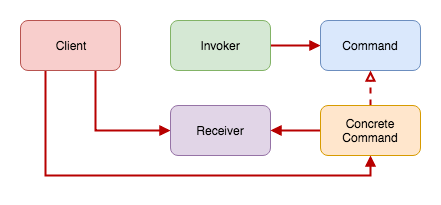

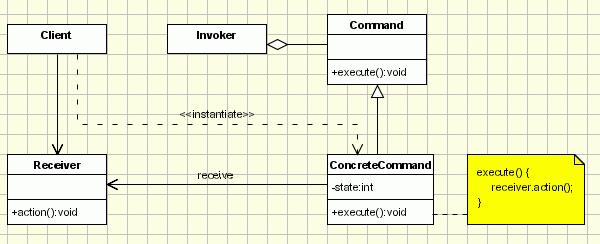

Các thành phần tham gia vào Command Pattern:

- **Command**: Interface chứa một phương thức trừu tượng thực thi (execute) một hành động (operation). Hành động sẽ được đóng gói dưới dạng Command
- **ConcreteCommand**: Triển khai từ Command. Ta đưa hành động vào và đóng gói thành một command. Thực thi bằng việc gọi operation() hoặc execute(). Mỗi một ConcreteCommand sẽ phục vụ cho một hành động riêng
- **Invoker**: Nơi quản lí command, có nhiệm vụ thực thi ConcreteCommand được đưa vào. Nhằm giảm sự phụ thuộc vào một ConcreteCommand cụ thể nào đó
- **Receiver**: Đây là thành phần thực sự xử lý business logic cho request/yêu cầu. Trong phương thức execute() của ConcreteCommand chúng ta sẽ gọi method thích hợp trong Receiver
- **Client**: Tiếp nhận request/yêu cầu từ phía người dùng, đóng gói request/yêu cầu thành ConcreteCommand thích hợp và thiết lập receiver của nó

### 2.5. Thực hành

- Tạo request/yêu cầu thực hiện hành động cho bóng đèn từ người dùng

```js
class Light {
    public light: string = "light";
}
```

- Khai cấu cấu trúc interface Command

```js
interface Command {
    execute(): any;
}
```

- Tạo ra 2 ConcreteCommand triển khai từ Command, ứng với 2 chức năng bật/tắt bóng đèn

```js
class CommandOn implements Command {
    private object?: Light;
    constructor(object?: Light) {
        this.object = object;
    }
    execute() {
        console.log(this.object?.light + ' on')
    }
}
class CommandOff implements Command {
    private object?: Light;
    constructor(object?: Light) {
        this.object = object;
    }
    execute() {
        console.log(this.object?.light + ' off')
    }
}
```

- Tạo RemoteControl chỉ để làm nhiệm vụ thực thi ConcreteCommand được đưa vào (nhằm giảm sự phụ thuộc vào đối tượng ConcreteCommand cụ thể)

```js
class RemoteControl {
    private command?: Command;
    setCommand(command: Command) {
        this.command = command
    }
    run() {
        this.command?.execute()
    }
}
```

- Cilent sẽ tạo RemoteControl, sau khi nhận request/yêu cầu từ người dùng thì set vào ConcreteCommand tương ứng và đưa vào RemoteControl để thực thi

```js
let remote = new RemoteControl()
remote.setCommand(new CommandOn(new Light()))
remote.run() // light on
```

## 3. Mediator
>
> Cung cấp một lớp trung gian có nhiệm vụ xử lý thông tin liên lạc giữa các lớp

Sử dụng mối quan hệ many-to-many giữa các đối tượng tượng tương đồng để đạt đến được trạng thái "full object".

### 3.1. Vấn đề

Chúng ta muốn thiết kế các thành phần có thể tái sử dụng được, nhưng sự phụ thuộc giữa các thành phần có thể tái sử dụng lại cho thấy hiện tượng "spaghetti code".

"Spaghetti code" là một cụm từ chỉ mã nguồn có cấu trúc điều khiển phức tạp và rắc rối, đặc biệt là sử dụng nhiều câu lệnh GOTO, ngoại lệ, luồng hoặc các cấu trúc phân nhánh khác "không có cấu trúc". Nó được đặt tên như vậy bởi vì luồng chương trình được sắp xếp giống như một bát spaghetti, tức là bị xoắn và rối.

"Spaghetti code" có thể do nhiều yếu tố, chẳng hạn như việc sửa đổi liên tục của một số người có phong cách lập trình khác nhau trong một thời gian dài. Các chương trình có cấu trúc giảm đáng kể tỉ lệ "spaghetti code".

### 3.2. Giải quyết

Do đó ta sử dụng Mediator Pattern. Các Component trong Mediator Pattern thay vì tương tác trực tiếp với nhau trong quá trình hoạt động thì sẽ đều phải tương tác với nhau thông qua một đối tượng là Mediator. Đối tượng Mediator này sẽ tiếp nhận các sự kiện được gửi tới từ các Component khác nhau và xử lý chúng. Mediator đóng vai trò như một người điều phối các công việc được gửi tới và giải quyết các công việc đó tập trung tại một chỗ.

### 3.3. Mediator được sử dụng khi nào?

- Trường hợp có nhiều các đối tượng tương tác trực tiếp với nhau. Nó giúp các sự kiện của các đối tượng được điều tiết một cách rõ ràng, loại bỏ đi sự cồng kềnh và chồng chéo nhau của source code
- Điều chỉnh hành vi giữa các lớp một cách dễ dàng, không cần chỉnh sửa ở nhiều lớp

### 3.4. Ví dụ

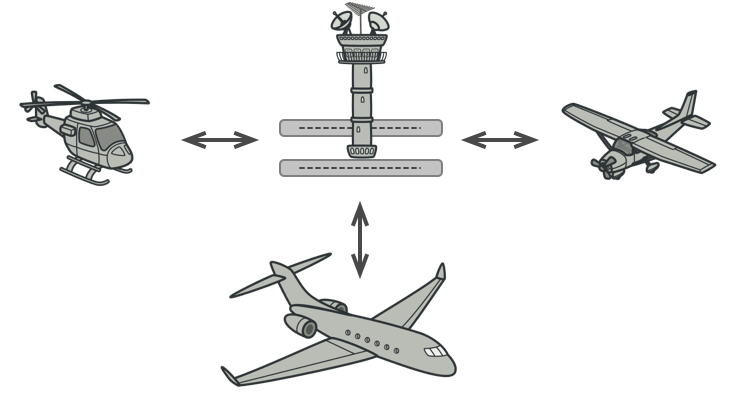

Tháp điều khiển tại sân bay có kiểm soát là một ví dụ về hoạt động của Mediator Pattern. Các phi công của các máy bay đang cất cánh hoặc hạ cánh kết nối với tháp chứ không phải giao tiếp rõ ràng với nhau. Những khó khăn về việc ai có thể cất hoặc hạ cánh được thi hành bởi tháp điều khiển. Điều quan trọng cần lưu ý là tháp không kiểm soát toàn bộ chuyến bay. Nó tồn tại chỉ để thực thi các quy định an toàn trong lúc cất và hạ cánh.

### 3.5. Cấu trúc

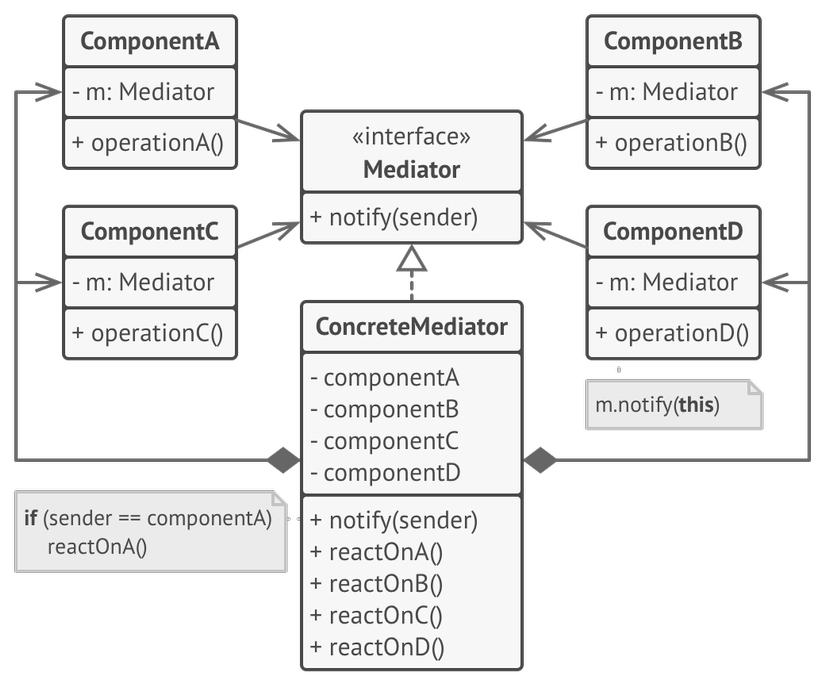

Các thành phần tham gia vào Mediator Pattern:

- **Components**: Là các đối tượng chứa đựng các business logic và cần phải tương tác với nhau trong quá trình hoạt động
- **Mediator**: Là lớp trừu tượng để khai báo các phương thức giúp cho các Component có thể tương tác với nhau
- **ConcreteMediator**: Là đối tượng chung gian được triển khia từ interface Mediator giúp cho các Component tương tác qua lại với nhau

### 3.6. Thực hành

- Khai báo interface BaseComponent có một tham chiếu đến một ConcreteMediator và từ đó tạo ra 2 ConcreteComponent mẫu có các phương thức hành động

```js
abstract class BaseComponent {
    protected mediator?: Mediator
    constructor(mediator?: Mediator) {
        this.mediator = mediator
    }
    update(mediator?: Mediator) {
        this.mediator = mediator
    }
}

class Component1 extends BaseComponent {
    constructor(mediator?: Mediator) {
        super(mediator)
    }
    update(mediator?: Mediator) {
        super.update(mediator)
    }
    doA() {
        console.log("Component 1 does A.")
        this.mediator?.notify("A")
    }
    doB() {
        console.log("Component 1 does B.\n")
        this.mediator?.notify("B")
    }
}

class Component2 extends BaseComponent {
    constructor(mediator?: Mediator) {
        super(mediator)
    }
    update(mediator?: Mediator) {
        super.update(mediator)
    }
    doC() {
        console.log("Component 1 does C")
        this.mediator?.notify("C")
    }
    doD() {
        console.log("Component 1 does D")
        this.mediator?.notify("D")
    }
}
```

- Tạo ra interface Mediator có phương thức in ra thông báo tùy theo event đầu vào được gửi từ các ConcreteComponent và triển khai một ConcreteMediator

```js
interface Mediator {
    notify(event: String): void
}

class ConcreteMediator implements Mediator {
    constructor(...components: BaseComponent[]) {
        for(let component of components) {
            component.update(this)
        }
    }
    updateMediator(component: BaseComponent) {
        component.update(this)
    }
    notify(event: String) {
        console.log(`Mediator reacts on ${event}`)
    }
}
```

- Sử dụng Mediator Pattern

```js
let component1 = new Component1()
let component2 = new Component2()
let mediator = new ConcreteMediator(component1, component2)

component1.doA()
console.log('\n')
component2.doC()
```

- Kết quả

```
Component 1 does A.
Mediator reacts on A

Component 1 does C
Mediator reacts on C
```

## 4. Memento
>
> Cho phép chúng ta lưu trữ và khôi phục trạng thái của một đối tượng mà không tiết lộ chi tiết bên trong của nó

### 4.1. Memento Pattern được sử dụng khi nào?

Memento Pattern được sử dụng bất cứ khi nào chúng ta muốn lưu và sau đó khôi phục trạng thái của một Object. Ví dụ như khi chúng ta chơi game, chúng ta muốn lưu lại tất cả những trạng thái chúng ta đã chơi trước đó để sau khi quit game và mở lại thì chúng ta có thể tiếp tục chơi. Các ứng dụng cần chức năng cần Undo/ Redo: Lưu trạng thái của một đối tượng bên ngoài và có thể restore/rollback sau này. Thích hợp với các ứng dụng cần quản lý transaction.

### 4.2. Cách thức hoạt động

Memento Pattern sẽ cấu trúc các dữ liệu cần lưu của một Object thành một **State**, sau đó sẽ lưu lại State này. Các State sau khi được lưu lại sẽ được gọi là các **Memento**. **CareTaker** sẽ đóng vai trò lưu trữ các State thành Memento và xuất các Memento thành State để có thể sử dụng. Do trạng thái của các Object đều được lưu trữ trong State nên khi State này được truyền qua các Object khác nhau thì sẽ không để lộ các implement chi tiết của các Object đó.

### 4.3. Ưu điểm

- Bảo bảo nguyên tắc đóng gói: sử dụng trực tiếp trạng thái của đối tượng có thể làm lộ thông tin chi tiết bên trong đối tượng và vi phạm nguyên tắc đóng gói

### 4.4. Nhược điểm

- Khi có một số lượng lớn Memento được tạo ra có thể gặp vấn đề về bộ nhớ, performance của ứng dụng
- Khó đảm bảo trạng thái bên trong của Memento không bị thay đổi

### 4.5. Cấu trúc

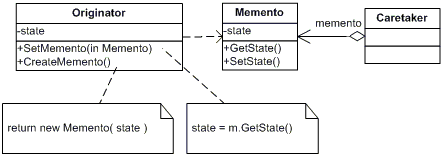

Các thành phần tham gia vào Memento Pattern:

- **Originator**: Là Object có trạng thái được lưu trữ hoặc khôi phục
- **Mementor**: Là trạng thái (State) của Object khi đang được lưu trữ
- **CareTaker**: Đóng vai trò lưu trữ và cấp phát các Memento. Nó có trách nghiệm lưu trữ các State ở dạng Memento và cấp phát các State cho các Object khi cần

### 4.6. Ví dụ

- Khai báo cấu trúc Memento

```js
class Memento {
    constructor(private readonly state: string) { }
    getSavedState(): string {
        return this.state
    }
}
```

- Tạo class Originator hỗ trợ lưu trữ và restore state từ Memento

```js
class Originator {
    private state!: string
    set(state: string): void {
        console.log("Originator: Setting state to " + state)
        this.state = state
    }
    saveToMemento(): Memento {
        console.log("Originator: Saving to Memento.")
        return new Memento(this.state)
    }
    restoreFromMemento(memento: Memento): void {
        this.state = memento.getSavedState()
        console.log("Originator: State after restoring from Memento: " + this.state)
    }
}
```

- Tạo CareTaker có nhiệm vụ lưu trữ state và lấy ra khi cần

```js
 // CareTaker
let savedStates : Array<Memento> = new Array<Memento>()
```

- Client sử dụng

```js
originator.set("State #1")
originator.set("State #2")
savedStates.push(originator.saveToMemento())
originator.set("State #3")
savedStates.push(originator.saveToMemento())
originator.set("State #4")

// Restore lại state cũ nhất đã lưu
originator.restoreFromMemento(savedStates[0])
```

- Kết quả

```
Originator: Setting state to State #1
Setting state to State #2
Saving to Memento.
Setting state to State #3
Saving to Memento.
Setting state to State #4
State after restoring from Memento: State #2
```

## 5. Observer
>
> Một đối tượng, gọi là subject, duy trì một danh sách các thành phần phụ thuộc nó, gọi là observer, và thông báo tới chúng một cách tự động về bất cứ thay đổi nào, thường thì bằng cách gọi một hàm của chúng

### 5.1. Vấn đề

Giả sử chúng ta có một bảng tính excel với nhiều trang tính chứa các dữ liệu cần để thống kê. Ta có thể tạo ra vô số biểu đồ sử dụng dữ liệu ở các trang tính đó để hiển thị ra kết quả thống kê. Khi ta thay đổi dữ liệu ở một trang tính, các biểu đồ có sử dụng dữ liệu đó cũng phải được cập nhật để có số liệu thống kê chính xác. Ta có thể thấy là số lượng biểu đồ có thể dùng dữ liệu ở một trang tính là không giới hạn.
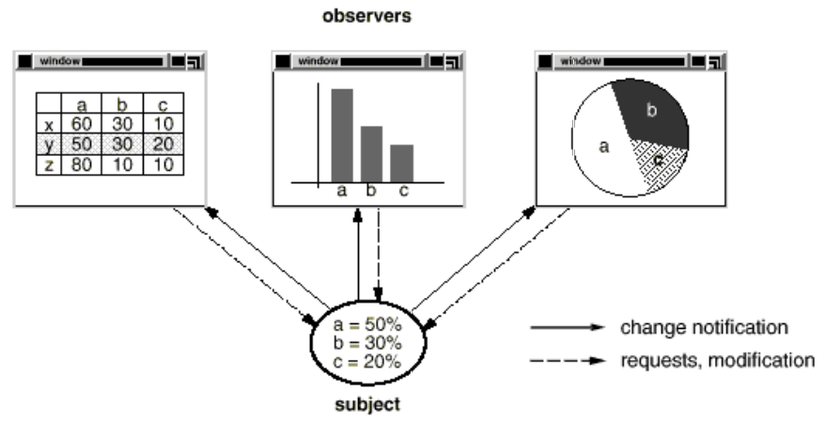

### 5.2. Giải quyết

Hướng giải quyết khi sử dụng Observer Pattern: Trang tính ở đây đóng vai trò là subject, còn các biểu đồ chính là các observer. Mỗi khi trang tính được cập nhật dữ liệu, ta sẽ gọi cập nhật đến các biểu đồ phụ thuộc dữ liệu với trang tính đó.

### 5.3. Khi nào nên dùng Observer Pattern?

- Sử dụng mối quan hệ 1 - many khi mà một đối tượng có sự thay đổi trạng thái, tất các thành phần phụ thuộc của nó sẽ được thông báo và cập nhật một cách tự động
- Một đối tượng có thể thông báo đến một số lượng không giới hạn các đối tượng khác

### 5.4. Cấu trúc

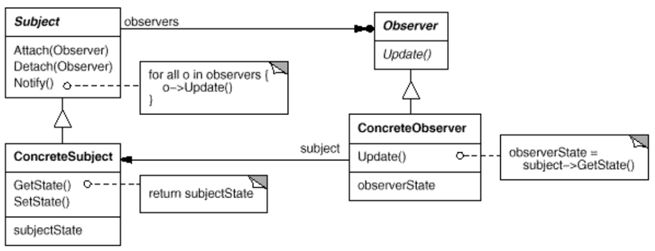

Các thành phần tham gia vào Observer Pattern:

- **Subject**:
  - Biết danh sách không giới hạn các observers của nó
  - Cung cấp một giao diện để có thể thêm và loại bỏ observer
- **Observer**:
  - Định nghĩa một giao diện cập nhật cho các đối tượng sẽ được subject thống báo đến khi có sự thay đổi trạng thái
- **ConcreteSubject**:
  - Lưu trữ trạng thái danh sách các ConcreateObserver.
  - Gửi thông báo đến các observer của nó khi có sự thay đổi trạng thái
- **ConcreteObserver**:
  - Có thể duy trì một liên kết đến đối tượng ConcreteSubject
  - Lưu trữ trạng thái của subject
  - Thực thi việc cập nhật để giữ cho trạng thái đồng nhất với subject gửi thông báo đến

### 5.5. Thực hành

- Khai báo interface Observer và triển khai ConcreteObserver

```js
interface Observer {
    update(mesage: string): void
}

class ConcreteObserver implements Observer {
    constructor(private beforeMessage: string) {}
    update(message: string) {
        console.log(this.beforeMessage + " " + message)
    }
}
```

- Tạo interface Subject và triển khai ConcreteSubject có chức năng gửi thông báo đến các ConcreteObserver khi có sự thay đổi

```js
interface Subject {
    observers : Array<Observer>
    attach(observer: Observer) : void
    detach(observer: Observer): void
    notifyChange(message: string): void
}
class ConcreteSubject implements Subject {
    observers: Array<Observer> = new Array<Observer>()
    attach(observer: Observer): void {
        this.observers.push(observer)
    }
    detach(observer: Observer): void {
        this.observers.splice(this.observers.indexOf(observer), 1)
    }
    notifyChange(message: string): void {
        for (let observer of this.observers) {
            observer.update(message)
        }
    }
}
```

- Sử dụng

```js
let subject : Subject = new ConcreteSubject()
let observer1 : Observer = new ConcreteObserver("Message 1 updated:")
let observer2 : Observer = new ConcreteObserver("Message 2 updated:")
subject.attach(observer1)
subject.attach(observer2)

subject.notifyChange('Subject notify!')
subject.detach(observer1)
console.log("Removed Observer 1\n")
subject.notifyChange('Subject notify!')
```

- Kết quả

```
Message 1 updated: Subject notify!
Message 2 updated: Subject notify!
Removed Observer 1
Message 2 updated: Subject notify!
```

## 6. Strategy
>
> Cho phép chúng ta định nghĩa các business logic thành các đối tượng khác nhau và các đối tượng này có thể thay thế cho nhau trong quá trình runtime

### 6.1. Strategy Pattern được sử dụng khi nào?

Strategy Pattern được sử dụng khi có hai hoặc nhiều hành vi có thể thay thế nhau trong quá trình runtime của project.

### 6.2. Cấu trúc

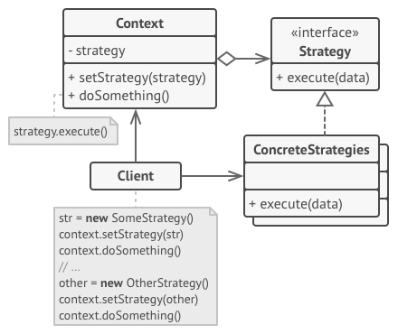

Các thành phần tham gia vào Strategy Pattern:

- **Object using Strategy**: Là đối tượng sử dụng các Concrete Strategy. Bên trong đối tượng sẽ chứa một tham chiếu có kiểu dữ liệu là Strategy Protocol
- **Strategy Protocol**: Định nghĩa các thuộc tính và phương thức mà tất cả các Concrete Strategy bắt buộc phải có và implement chúng
- **Concrete Strategy**: Là các class triển khai từ Strategy Protocol. Nó sẽ chứa đựng các business logic đặc thù của từng class

### 6.3. Thực hành

- Khai báo interface Strategy và triển khai 3 ConcreteStrategy thực hiện 3 phép toán khác nhau

```js
interface Strategy {
    doOperation(num1: number, num2: number): number
}
class OperationAdd implements Strategy {
    doOperation(num1: number, num2: number): number {
        return num1 + num2
    }
}
class OperationSubstract implements Strategy {
    doOperation(num1: number, num2: number) : number {
        return num1 - num2
    }
}
class OperationMultiply implements Strategy {
    doOperation(num1: number, num2: number) : number {
        return num1 * num2
    }
}
```

- Tạo class Context có tham chiếu đến ConcreteStrategy tương ứng tùy theo ngữ cảnh và sử dụng Strategy đó

```js
class Context {
    constructor(private strategy: Strategy) { }
    executeStrategy(num1: number, num2: number) : number {
        return this.strategy.doOperation(num1, num2)
    }
}
```

- Sử dụng

```js
let context : Context = new Context(new OperationAdd())
console.log("10 + 5 = " + context.executeStrategy(10, 5))

context = new Context(new OperationSubstract())
console.log("10 - 5 = " + context.executeStrategy(10, 5))

context = new Context(new OperationMultiply())
console.log("10 * 5 = " + context.executeStrategy(10, 5))
```

- Kết quả

```
10 + 5 = 15
10 - 5 = 5
10 * 5 = 50
```

## 7. Visitor
>
> Cho phép thay đổi, mở rộng các thao tác cho đối tượng mà không thay đổi cấu trúc, nội dung bên trong đối tượng

Để làm được điều này, các đối tượng (**Element**) phải tách các thao tác đó ra phương thức riêng và định nghĩa chúng trên các lớp tách biệt gọi là các lớp **Visitor**. Nhờ vậy các thao tác được tách độc lập ra khỏi cấu trúc đối tượng, giúp cho việc thay đổi thao tác trở nên linh hoạt.

Với mỗi một thao tác mới cho đối tượng được tạo ra, một lớp visitor tương ứng cũng được tạo ra.

Ngoài ra đây cũng là một kỹ thuật giúp chúng ta phục hồi lại **kiểu dữ liệu** bị mất của đối số truyền vào. Vì nó thực hiện gọi phương thức tương ứng dựa trên kiểu dữ liệu của cả đối tượng gọi và của đối số truyền vào (**Double Dispatch**).

### 7.1. Double Dispatch và Single Dispatch là gì?

- **Single Dispatch**: Tên phương thức được gọi chỉ dựa vào kiểu dữ liệu của đối tượng gọi nó

```js
class TestClass {
    testMethod(param: string) {
        console.log(param)
    }
}
new TestClass().testMethod("Hello World")
```

- **Double Dispatch**: Tên phương thức được gọi dựa vào kiểu dữ liệu của đối tượng gọi nó và kiểu dữ liệu của đối tượng đầu vào. Cũng là công nghệ mà Visitor Pattern sử dụng, do đó nó còn có tên là Double Dispatch

```js
class Visitor {
    visit(element: Element) {
        console.log(element.hello())
    }
}
class Element {
    hello() {
        return "Xin chào"
    }
    accept(Visitor: visitor) {
        visitor.visit(this)
    }
}
new Element().accept(new Visitor())
```

### 7.2. Ưu điểm

- Cho phép một hoặc nhiều hành vi được áp dụng cho một tập hợp các đối tượng tại thời điểm run-time, tách rời các hành vi khỏi cấu trúc đối tượng
- Đảm bảo nguyên tắc Open/Close: Đối tượng gốc không bị thay đổi, dễ dàng thêm hành vi mới cho đối tượng thông qua visitor

### 7.3. Khi nào nên dùng Visitor Pattern?

- Khi có một cấu trúc đối tượng phức tạp với nhiều class và interface. Người dùng cần thực hiện một số hành vi cụ thể của riêng đối tượng, tùy thuộc vào concrete class của chúng
- Chúng ta muốn di chuyển logic hành vi từ các đối tượng sang một lớp khác để xử lí để giảm phức tạp
- Khi cấu trúc dữ liệu của đối tượng ít khi thay đổi nhưng hành vi của chúng được thay đổi thường xuyên
- Khi muốn tránh sử dụng toán tử `instanceof`

### 7.4. Cấu trúc


Các thành phần tham gia vào Visitor Pattern:

- **Element**: Interface khai báo khung xương cho đối tượng xử lí dữ liệu. Đặc biệt phải khai báo phương thức `accept()` để nhận các thao tác đưa vào
- **ConcreteElement**: Đối tượng xử lí dữ liệu triển khai từ **Element**
- **Visitor**: Interface khai báo khung xương cho các visitor hỗ trợ định nghĩa và đưa các thao tác thay thế vào ConcreteElement
- **ConcreteVisitor**: Lớp hỗ trợ gọi các thao tác thay thế trên ConcreteElement được triển khai từ Visitor

### 7.5. Ví dụ

Giả sử chúng ta có một bài toán như sau: Bạn là một ladykiller, bạn muốn tỏ tình với một cô gái nhưng không biết quốc tịch của cô gái ấy là gì, đơn giản là chúng ta không thể nói "anh yêu em" với một cô gái người Nhật Bản được, vì cô ấy sẽ chẳng hiểu gì cả, thay vì vậy chúng ta sẽ nói "Aishite imasu" 😃. Do đó ta sẽ viết một hàm chung để nói lời yêu thương của ta đó là `saylove()` và truyền vào lời yêu tùy theo quốc tịch của mỗi nàng.

```js
interface Lady {
    sayLove(): void;
}

class AmericanLady implements Lady {
    sayLove(): void {
        console.log("I love you");
    }
}

class JapanLady implements Lady {
    sayLove(): void {
        console.log("Aishite imasu");
    }
}

let lady : Lady = new JapanLady();
lady.sayLove(); // Kết quả: Aishite imasu
```

Vấn đề lại xuất hiện khi bạn muốn thay đổi, ví dụ khi chúng ta muốn thêm một phương thức `sayGoodBye()` nữa đi, lại phải thêm vào inferface `Lady` rồi implement cho tất cả những lớp đã triển khai sẽ thay đổi rất mất thời gian cũng thêm rủi ro. Do đó giờ là lúc sử dụng Visitor Partten.

- Đầu tiên ta sửa lại interface `Lady` và triển khai lại `JapanLady` và `AmericaLady` chỉ với phương thức `accept()` để giảm độ phức tạp xử lí và đem phần xử lí đó sang cho `ConcreteVisitor`

```js
interface Lady {
    accept(visitor: Visitor): void
}

class AmericanLady implements Lady {
    accept(visitor: Visitor): void {
        visitor.visit(this)
    }
}

class JapanLady implements Lady {
    accept(visitor: Visitor): void {
        visitor.visit(this)
    }
}
```

- Khai táo interface `Visitor` tạo khung xương và triển khai `SayLoveVisitor` có chức năng in ra lời iu với các lady (do Javascript không hỗ trợ đa hình mà không kế thừa nên tạm thời dùng `instanceof` để thay thế)

```js
interface Visitor {
    visit(lady: Lady): void
}

class SayLoveVisitor implements Visitor {
    visit(lady: Lady): void {
        if (lady instanceof AmericanLady)
            console.log('I love you')
        if (lady instanceof JapanLady)
            console.log('Aishite imasu')
    }
}
```

- Chạy thử

```js
let lady: Lady = new AmericaLady()
lady.accept(new SayLoveVisitor()) // Kết quả: I love you
```

- Ví dụ sau này chúng ta chán chê rồi và muốn `SayGoodBye` lady này để tán lady khác. Ta sẽ tạo thêm một ConcreteVisitor cho chức năng này

```js
class SayGoodByeVisitor implements Visitor {
    visit(lady: Lady): void {
        if (lady instanceof AmericanLady)
            console.log('Good bye!')
        if (lady instanceof JapanLady)
            console.log('Sayounara!')
    }
}
```

- Chạy thử nào

```js
let lady: Lady = new JapanLady()
lady.accept(new SayGoodByeVisitor()) // Kết quả: Sayounara!
```

### 7.6. Kết luận

Khi muốn mở rộng thao tác của đối tượng xử lí ConcreteElement thì ta chỉ cập nhật trên Visitor mà không cần sửa đổi ConcreteElement. Điều này thỏa mã quy tắc Open/Close.

Hạn chế lớn nhất của Visitor Pattern đó là không hỗ trợ cho việc mở rộng Element, do việc mở rộng Element sẽ dẫn đến cập toàn bộ interface và class của Visitor. Nhưng ta có thể sửa lỗi này bằng các tinh chỉnh khác nhau cho Pattern cộng với một chút khéo léo trong chỉnh sửa cấu trúc dữ liệu và xử lí dữ liệu.

## 8. State
>
> Cho phép một đối tượng có thể thay đổi hành vi của nó khi có sự thay đổi trạng thái nội bộ trong lúc run-time

### 8.1. Ưu điểm

- Đối tượng được thay đổi trạng thái một cách rõ ràng
- Trạng thái của những đối tượng có thể chia sẻ lẫn nhau
- Đảm bảo nguyên tắc Single Responsibility Principle (SRP): tách biệt mỗi State tương ứng với 1 class riêng biệt
- Đảm bảo nguyên tắc Open/Closed Principle (OCP): chúng ta có thể thêm một State mới mà không ảnh hưởng đến State khác hay Context hiện có
- Giữ hành vi cụ thể tương ứng với trạng thái

### 8.2. State Pattern được sử dụng khi nào?

- State Pattern thường được dùng trong các hệ thống có nhiều trạng thái khác nhau và thay đổi trong suốt quá trình hoạt động. Số lượng các trạng thái (state) có thể bị giới hạn số lượng hoặc không giới hạn số lượng. Ví dụ, đèn giao thông sẽ có 3 trạng thái là "đỏ", "vàng", "xanh" thay đổi liên tục trong suốt quá trình hoạt động của nó
- Ngoài ra, State Pattern còn được sử dụng để giảm thiểu việc sử dụng các câu lệnh if-else lồng nhau một cách phức tạp

### 8.3. Cấu trúc

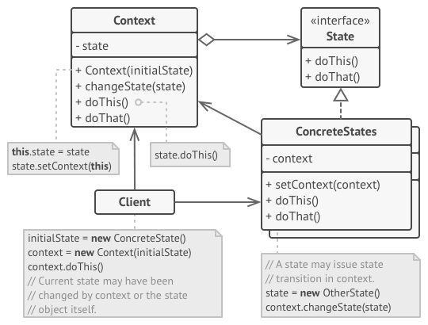

Các thần phần tham gia vào State Pattern:

- **Context**: Là đối tượng có chứa trạng thái hoặc hành vi thay đổi
- **State**: Là interface được sử dụng để liệt kê và khai báo các property và function cần thiết của State. Bằng cách này, chúng ta có thể xác định được các thuộc tính và các hàm cần phải có trong các ConcreteState
- **ConcreteState**: Triển khai từ State, lưu trữ trạng thái của Context. Có thể có nhiều ConcreteState, mỗi ConcreteState sẽ đại diện cho một trạng thái của Context

### 8.4. Cách thức hoạt động

- Trong State Pattern, Context sẽ được khởi tạo cùng với trạng thái mặc định của nó
- Mỗi khi trạng thái của Context thay đổi, nó sẽ lưu lại trạng thái mới thay cho trạng thái cũ; đồng thời sẽ xử lý các tác cụ theo trạng thái mới của nó. Điều đó có nghĩa là hoạt động của Context sẽ thay đổi tùy thuộc theo trạng thái của mình

### 8.5. Luồng hoạt động

- Context sẽ định nghĩa những hành vi có thể giao tiếp với Client, vì thế client sẽ yêu cầu các hành vi thông qua Context
- Context sẽ chứa một thể hiện của State, State ban đầu có thể được cài đặt từ Client, nhưng khi đã cài đặt rồi thì Client không được sửa đổi nó nữa
- Context có thể gửi chính nó như một argument tới State, vì thế State có thể truy cập vào Context để thay đổi trạng thái nếu cần thiết
- Khi Context thực hiện hành vi, nó sẽ gọi State hiện tại để thực hiện hành vi đó, thực hiện xong, State có thể sẽ thay đổi trạng thái từ Context nếu cần

### 8.6. Ví dụ

Chúng ta sẽ định nghĩa một interface `State` và có 2 trạng thái riêng của nó là `LowerCaseState` và `MultipleUpperCaseState` tương ứng với việc in ra chữ thường hay chữ hoa.

```js
interface State {
    writeName(context: StateContext, name: string): void;
}

class LowerCaseState implements State {
    writeName(context: StateContext, name: string) {
        console.log(name.toLowerCase());
        context.setState(new MultipleUpperCaseState());
    }
}

class MultipleUpperCaseState implements State {
    private count: number = 0;
    writeName(context: StateContext, name: string): void {
        console.log(name.toUpperCase());
        /* Change state after StateMultipleUpperCase's writeName() gets invoked twice */
        if (++this.count > 1) {
            context.setState(new LowerCaseState());
        }
    }
}
```

Lớp `Context` sẽ chứa một biến `state`, đặc trưng là trạng thái hiện tại của `Context`, `state` sẽ được gán trạng thái mặc định khi `Context` được khởi tạo.

Bên cạnh đó, lớp `Context` sẽ định nghĩa hàm setter cho state để thay đổi trạng thái mỗi khi thực hiện hành vi.

Hành vi được thực hiện ở đây là `writeName()`.

```js
class StateContext {
    private state!: State;
    constructor() {
        this.state = new LowerCaseState();
    }
    setState(newState: State): void {
        this.state = newState;
    }
    writeName(name: string): void {
        this.state.writeName(this, name);
    }
}
```

Sử dụng

```
monday
TUESDAY
WEDNESDAY
thursday
FRIDAY
SATURDAY
sunday
```

### 8.7. Design Pattern liên quan

- **Flyweight Pattern**: Nếu ở bên phần trên, một trong những kết quả của State Pattern là các trạng thái của các đối tượng có thể chia sẻ cho nhau, Flyweight Pattern sẽ chỉ rõ khi nào cần chia sẻ những trạng thái và thực hiện như nào để chia sẻ được
- **Singleton Pattern**: Thông thường, những đối tượng State được thiết kế theo mẫu Singleton, vì bản thân các state chúng ta chỉ cần một thể hiện duy nhất
- **Strategy Pattern**: Trong State Pattern, các state cụ thể được liên kết với nhau thông qua cài đặt bên trong phương thức của đối tượng, nhờ đó các state có thể tự động chuyển đổi cho nhau trong quá trình run-time. Còn Strategy Pattern không quan tâm các state khác mà chỉ nhận state được Client đưa vào

## 9. Repository
>
> Repository Pattern là lớp trung gian giữa việc truy cập dữ liệu và xử lý logic, giúp cho việc truy cập dữ liệu chặt chẽ và bảo mật hơn

### 9.1. Cấu trúc

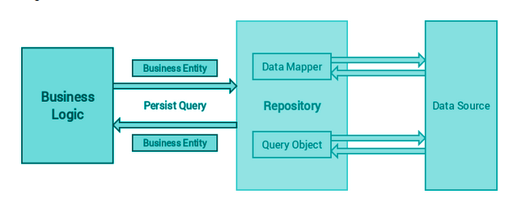

Repository Pattern là lớp trung gian giữa tầng Data Access và Business Logic. giúp cho việc truy cập dữ liệu chặt chẽ và bảo mật hơn.

Bình thường để lấy dữ liệu thì chúng ta đơn giản viết một `Controller` query đến database để lấy ra dữ liệu. Nhưng với Repository Pattern chúng ta thấy `Repository` là trung gian giữa `Controller` và `Model`. Hiểu đơn giản thì khi có request gọi tới `Controller`, `Controller` gọi tới `Repository` rồi thằng này gọi tới `Model` lấy data và xử lý, `Controller` lấy dữ liệu thì chỉ việc gọi đến `Repository`.

### 9.2. Ưu điểm

- Dễ bảo trì và mở rộng code
- Tăng tính bảo mật và rõ ràng cho code
- Lỗi ít hơn
- Tránh việc lặp code

### 9.3. Ví dụ

```js
getPost() {
    let posts = Post.orderBy('id', 'desc').get();
    return posts;
}
```

Khá là dễ phải không? Nhưng vấn đề ở chỗ nếu khách hàng muốn sắp xếp các post theo bảng chữ cái thì sao? Chúng ta phải vào hàm và sửa lại đoạn code đó. Hay khi cấu trúc bảng thay đổi, chúng ta cũng bắt buộc phải sửa lại phương thức `getPost()` trong hằng hà các phương thức khác. Hoặc trường hợp xấu là quản lí muốn thay thế bằng database khác và chúng ta buộc phải viết hàm get mới. Do đó chúng ta sử dụng đến Repository Pattern.

Chúng ta sẽ phải tạo thêm một lớp là `PostRepository` có thể đặt trong một thư mục khác tên là Repositories. Ở đây chúng ta viết hàm lấy post theo ý chúng ta muốn, và khi có sự sửa đổi hay mở rộng thì chúng ta chỉ việc sửa ở đây thôi.

```js
class PostRepository {
    getPostById() {
        return Post.orderBy('id', 'desc').get();
    }
}
```

Và lúc này trong class `PostController` chúng ta sẽ viết

```js
import { PostRepository } from './../Repositories';
class PostController extends Controller {
    constructor(private postRepository: PostRepository) { }
    getPost() {
        let posts = this.postRepository.getPostById();
        return posts;
    }
}
```
