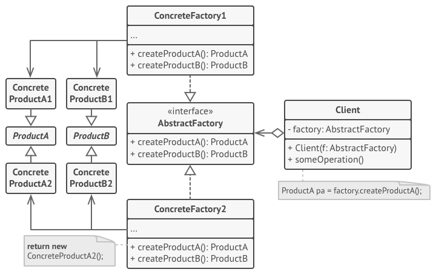
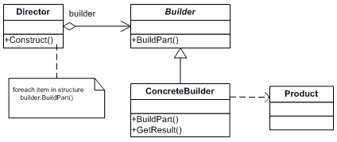
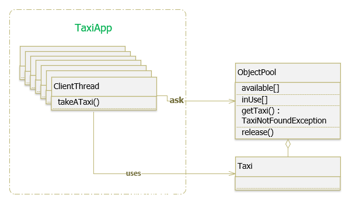
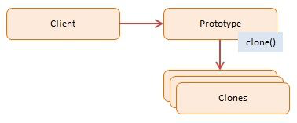

## 1. Singleton
>
> Tạo ra 1 instance từ 1 class sử dụng cho toàn hệ thống và đảm bảo không có instance thứ 2 được tạo ra. Sử dụng khi muốn chạy 1 chương trình con độc lập để kiểm tra và xử lí cho toàn hệ thống

```javascript
public class Singleton {
    private constructor() {} // Private constructor để các class khác không thể tạo instance mới
    
    // Cách này là cách đơn giản nhất nhưng nhược điểm là instance tạo ra nhưng có thể không được sử dụng
    // private static instance: Singleton = new Singleton();
    // public static getInstance() : Singleton {
    //     return Singleton.instance;
    // }

    // Cách viết này chỉ khởi tạo instance khi có class gọi đến
    private static instance: Singleton;
    public static getInstance() : Singleton {
        if (!Singleton.instance) {
            Singleton.instance = new Singleton();
        }
        return Singleton.instance;
    }

    // Method
    public helloWorld() {
        console.log("Hello World");
    }
}
Singleton.getInstance().helloWorld(); // Kết quả: "Hello World"
```

### Lưu ý

Do javascript chỉ có đơn luồng nên không cần quan tâm đến vấn đề 2 class gọi đến instance cùng lúc (tạo ra 2 instance cùng lúc)

## 2. Factory
>
>Quản lý và trả về các đối tượng theo yêu cầu, giúp cho việc khởi tạo đổi tượng một cách linh hoạt hơn. Thường áp dụng để khởi tạo các đối tượng từ các class tương tự nhau (thường là implement từ 1 interface).

### 2.1. Chức năng

- Tạo ra 1 cách mới trong việc khởi tạo Object
- Che giấu xử lý logic của việc khởi tạo (Trong trường hợp bạn đang muốn viết 1 thư viện để người khác sử dụng)
- Giảm sự phụ thuộc: Nếu có class nào extend class CarFactory để sử dụng thì khi thêm xe mới vào chỉ sửa từ phần class CarFactory trở lên thôi

Ví dụ: Một xưởng sản xuất xe muốn trưng bày cho khách, nhưng có nhiều loại xe khác nhau, vì vậy xưởng phải lấy hết trong kho mỗi hãng 1 chiếc nhưng chỉ đưa cho khách hàng xem 1 loại xe mà khách hàng cần, gây nên tốn tài nguyên không cần thiết.

- Tạo ra các mẫu xe:

```javascript
interface Car {
    viewCar(): void;
}
class Honda implements Car {
    viewCar() {
        console.log("Honda-chan");
    }
}
class Nexus implements Car {
    viewCar() {
        console.log("Nexus-chan");
    }
}
class Toyota implements Car {
    viewCar() {
        console.log("Toyota-chan");
    }
}
```

- **Cách bình thường**: Chuẩn bị toàn bộ xe mỗi loại 1 chiếc

```javascript
class CarFactory {
    public honda : Honda = new Honda();
    public nexus : Nexus = new Nexus();
    public toyota : Toyota = new Toyota();
}
var viewCar = new CarFactory();
car.honda.viewCar(); // Kết quả "Honda-chan"
```

- **Factory pattern**: Chỉ chuẩn bị loại xe mà khách yêu cầu

```javascript
class CarFactory {
    public car!: Car;
    constructor(carType : string) {
        switch(carType) {
            case "HONDA": {
                this.car = new Honda();
                break;
            }
            case "NEXUS": {
                this.car = new Nexus();
                break;
            }
            case "TOYOTA": {
                this.car = new Toyota();
            }
        }
    }
}
var car = new CarFactory("TOYOTA");
car.car.viewCar();
```

## 3. Factory Method
>
>Factory Method là một mẫu thiết kế sáng tạo giúp giải quyết vấn đề tạo ra các đối tượng sản phẩm mà không cần chỉ định các lớp cụ thể của chúng.

- Pattern này được sinh ra nhằm mục đích khởi tạo đối tượng mà bản thân muốn che giấu class nào được khởi tạo.
- Factory Method định nghĩa một phương thức, nên được sử dụng để tạo các đối tượng thay vì gọi hàm dựng trực tiếp (toán tử new). Các lớp con có thể ghi đè phương thức này để thay đổi lớp đối tượng sẽ được tạo.

### 3.1. Cấu trúc

<!--  -->

*Trên hình ta thấy interface **Product** được trỏ đến nhiều nhất, do đó ta bắt đầu định nghĩa từ đây.*
*Trên hình ta chia ra làm 2 phần (trên và dưới). Phía trên ta xem như hợp đồng mà 2 sếp kí kết với nhau, còn phía dưới là nhân viên 2 bên giao tiếp với nhau nhờ các điều khoản hợp tác trong bản hợp đồng.*

- Định nghĩa Product

```javascript
interface Product {
    doStuff() : void;
}
```

- Tạo ra mẫu sản phẩm từ định nghĩa Product

```javascript
class ConcreteProduct1 implements Product {
    doStuff() {
        return "Result of the ConcreteProduct1";
    }
}
class ConcreteProduct2 implements Product {
    doStuff() {
        return "Result of the ConcreteProduct2";
    }
}
```

- Định nghĩa Creator

```javascript
abstract class Creator {
    public abstract createProduct() : Product;
    someOperation() {
        // Call the factory method to create a Product object.
        let product : Product = this.createProduct();
        // Now, use the product.
        return `Creator: The same creator's code has just worked with ${product.doStuff()}`;
    }
}
```

- Tạo ra một instance của Creator

```javascript
class ConcreteCreator1 extends Creator {
    public createProduct() {
        return new ConcreteProduct1();
    }
}
class ConcreteCreator2 extends Creator {
    public createProduct() {
        return new ConcreteProduct2();
    }
}
```

- Client sử dụng

```javascript
function clientCode(creator: Creator) {
    console.log(creator.someOperation());
}
console.log("App: Launched with the ConcreteCreator2\n");
clientCode(new ConcreteCreator2());
```

- Output

```
App: Launched with the ConcreteCreator2
The same creator's code has just worked with Result of the ConcreteProduct2
```

## 4. Abstract Factory
>
> Abstract Factory cung cấp một đối tượng bằng cách ẩn đi những sự phức tạp đằng sau nó, có nghĩa là chúng ta có một số lớp phức tạp nào đó mà được sử dụng theo từng ngữ cãnh cụ thể chúng có thể có một số chức năng, thuộc tính thống nhất theo một mô hình nào đó, có thể là một số lớp cấu trúc từ một lớp abstract, chúng ta sẽ kết hợp chúng lại để xử lý trong một lớp, mà ở đó mọi công việc xử lý được diễn ra và chỉ trả về những cái cần thiết, điều này giúp mô hình chặt chẽ và dễ dàng để sử dụng.

Mức độ sử dụng: Khá thường xuyên

### 4.1. Cấu trúc

<!--  -->

- Trước tiên ta định nghĩa sản phẩm ta muốn tạo ra là gì

```javascript
interface AbstractProductA {
    functionA(): string;
}
interface AbstractProductB {
    functionB(): string;
}
```

- Tạo ra một định nghĩa về nhà máy sản xuất sản phẩm A và B

```javascript
interface AbstractFactory {
    createProductA(): AbstractProductA;
    createProductB(): AbstractProductB;
}
```

- Tạo ra 2 nhà máy sản xuất 2 loại sản phẩm A và B nhưng khác phiên bản (nhà máy 1 sản xuất phiên bản 1, nhà máy 2 sản xuất phiên bản 2).
- Nhưng trước khi xây nhà máy ta cần tạo ra một mẫu (class) cho sản phẩm muốn sản xuất đã, để nhà máy ta tạo ra biết rằng ta muốn tạo ra sản phẩm như thế nào

```javascript
class ConcreteProductA1 implements AbstractProductA {
    functionA(): string {
        return "The result of the product A1.";
    }
}
class ConcreteProductA2 implements AbstractProductA {
    functionA(): string {
        return "The result of the product A2.";
    }
}
class ConcreteProductB1 implements AbstractProductB {
    functionB(): string {
        return "The result of the product B1.";
    }
}

class ConcreteProductB2 implements AbstractProductB {
    functionB(): string {
        return "The result of the product B2.";
    }
}
```

- Ta bắt đầu xây nhà máy sản xuất

```javascript
class ConcreteFactory1 implements AbstractFactory {
    createProductA(): AbstractProductA {
        return new ConcreteProductA1();
    }

    createProductB(): AbstractProductB {
        return new ConcreteProductB1();
    }
}
class ConcreteFactory2 implements AbstractFactory {
    createProductA(): AbstractProductA {
        return new ConcreteProductA2();
    }

    createProductB(): AbstractProductB {
        return new ConcreteProductB2();
    }
}
```

- Client sử dụng

```javascript
function clientCode(factory: AbstractFactory) {
    let product_a = factory.createProductA();
    let product_b = factory.createProductB();

    console.log(product_b.functionB());
}

console.log("Client: Testing client code with the first factory type");
clientCode(new ConcreteFactory1());
console.log("Client: Testing the same client code with the second factory type");
clientCode(new ConcreteFactory2());
```

- Output

```
Client: Testing client code with the first factory type
The result of the product B1.
Client: Testing the same client code with the second factory type
The result of the product B2.
```

Rút ra:

- Muốn tạo ra sản phẩm gì cần phải định nghĩa nó trước
- Muốn xây nhà máy sản xuất sản phẩm thì cần phải định nghĩa và tạo mẫu sản phẩm rồi mới đến định nghĩa và tạo ra nhà máy
- Bản chất là việc tạo ra nhiều lớp, định nghĩa và kết hợp chúng để giảm sự phụ thuộc và dễ bảo trì, nâng cấp. Nếu muốn thêm một sản phẩm mới thì chỉ việc thêm code chứ không sửa code.

### 4.2. Phân biệt Abstract Factory và Factory Method

#### 4.2.1. Giống nhau

- Đều là **Factory Pattern**
- Đều dùng để giảm sự phụ thuộc giữa chương trình với những cài đặt cụ thể
- Đều đóng gói (encapsulate) quá trình tạo ra đối tượng để giúp chương trình độc lập và giảm phụ thuộc với những kiểu cụ thể

#### 4.2.2. Khác nhau

##### Factory Method

- Dùng các lớp để tạo ra products.
- Tạo ra các products, objects nhờ vào sự kế thừa (inheritance) nghĩa là nếu muốn tạo ra các đối tượng bằng cách Factory Method, người ta cần phải extend một lớp và override lại hàm tạo Factory Method, rồi Factory Method sẽ tạo ra 1 object
- Ý tưởng của Factory Method Pattern, là sẽ sử dụng các lớp con để sinh ra 1 đối tượng mong muốn. Bằng cách đó, người dùng sẽ chỉ cần biết đến lớp trừu tượng như gia cầm, và các lớp con cụ thể sẽ lo về các kiểu gà, kiểu vịt, kiểu ngan. Vì vậy, nói theo cách khác, nó giúp chương trình độc lập với các kiểu (type) cụ thể đó.
- Khi muốn bổ sung thêm một product nữa vào nhóm các products chỉ cần một method.
- Factory Method dùng hàm Factory Method để tạo ra product cụ thể mà người dùng muốn, họ sẽ không biết cái gì được tạo ra, mà chỉ cần gọi hàm.

##### Abstract Factory

- Dùng các đối tượng để tạo ra products.
- Tạo ra các products, objects nhờ vào sự kết hợp các đối tượng.
- Tạo ra một kiểu trừu tượng (abstract type) để dùng vào việc tạo ra một nhóm những products khác. Khi đó, những lớp con của kiểu trừu tượng sẽ xác định cách tạo ra các products này. Để áp dụng được ý tưởng này, phải tạo ra một instance của một trong các lớp con trên (instance này là 1 factory) và đưa nó vào chỗ cần thiết trong code. Vì thế, giống như Factory Method, những nơi sử dụng factory của Abstract Factory sẽ hoàn toàn độc lập với những products cụ thể. Một lợi ích nữa của cách này là các products tương tự nhau đã được nhóm lại. Vậy nên khi cần bổ sung thêm một product nữa vào nhóm các products mà Abstract Factory có thể tạo ra, người dùng phải đi đổi tất cả các lớp con (các lớp con ở đây là các factories). Người dùng rất không thích Abstract Factory ở điểm này.
- Có khả năng tạo ra nhiều kiểu products khác nhau.
- Abstract Factory thường sử dụng nhiều hàm Factory Method theo cách của Factory Method để tạo các đối tượng bên trong những factories của chính nó. Những lớp factory con thường dùng các Factory Method để tạo các products tương ứng. Trong trường hợp này, các Factory Method được dùng thuần túy để tạo ra các products.

### 4.3. Vậy khi nào nên dùng Abstract Factory, khi nào nên dùng Factory Method?

- **Abstract Factory**: sử dụng khi nào cần cùng một lúc tạo ra nhiều loại products, và khi muốn chắc chắn những nơi sử dụng sẽ không cần biết đến những lớp cụ thể khi cần làm việc này.

- **Factory Method**: dùng khi cần tạo ra một kiểu product nào đó thôi, sử dụng để làm cho chương trình độc lập với những lớp cụ thể mà ta cần tạo 1 đối tượng, hoặc khi không biết sau này sẽ cần đến những lớp con nào nữa. Khi cần sử dụng Factory Method, hãy tạo tạo ra subclass (1 factory implement 1 kiểu abstract) và implement Factory Method.

Nguồn: quyển sách Head First – Design Pattern

## 5. Builder
>
>Builder pattern được tạo ra để xây dựng một đôi tượng phức tạp bằng cách sử dụng các đối tượng đơn giản và sử dụng tiếp cận từng bước, việc xây dựng các đối tượng đôc lập với các đối tượng khác

- Mẫu thiết kế này cho phép lập trình viên tạo ra những đối tượng phức tạp nhưng chỉ cần thông qua các câu lệnh đơn giản để tác động nên các thuộc tính của nó.
- Muốn thay đổi thiết kế cho việc lồng nhau của các hàm khởi tạo (Telescoping Constructor Pattern). Vấn đề này phát sinh khi lập trình viên làm việc với một lớp mà có chứa rất nhiều các thuộc tính và cần phải tạo ra nhiều hàm khởi tạo với số lượng các thuộc tính tăng dần.
- Cần tạo ra một đối tượng phức tạp, một đối tượng mà thuật toán để tạo tạo lập các thuộc tính là độc lập đối với các thuộc tính khác.

### 5.1. Ưu điểm

- Cung cấp thêm một cách khởi tạo đối tượng
- Hỗ trợ, loại bớt việc phải viết nhiều constructor

### 5.2. Hạn chế

- Phải tạo builder cho từng class khác nhau.

Mức độ sử dụng: Thường xuyên

### 5.3. Thành phần chính

- **Product**: Đại diện cho đối tượng cần tạo, đối tượng này phức tạp, có nhiều thuộc tính
- **Builder**: Là abstract class hoặc interface khai báo phương thức tạo đối tượng
- **ConcreteBuilder**: Kế thừa Builder và cài đặt chi tiết cách tạo ra đối tượng. Nó sẽ xác định và nắm giữ các thể hiện mà nó tạo ra, đồng thời nó cũng cung cấp phương thức để trả các các thể hiện mà nó đã tạo ra trước đó
- **Director**: Là nơi sẽ gọi tới Builder để tạo ra đối tượng

### 5.4. Cấu trúc

<!--  -->

*Trên hình ta thấy **interface Builder** được trỏ đến nhiều nhất, do đó ta bắt đầu từ đây. Nhưng trước đó cần phải khai báo định nghĩa Product. Vì muốn xây dựng builder của sản phẩm thì ta phải biết về định nghĩa sản phẩm đó đã.*

- Định nghĩa danh sách sản phẩm

```javascript
class Product {
    constructor(
        private partA: string, 
        private partB: string, 
        private partC: string
    ) { }
    show() : string {
        return `This product has 3 parts: ${this.partA}, ${this.partB} and ${this.partC}`;
    }
}
```

- Định nghĩa **Builder**

```javascript
abstract class Builder {
    abstract BuildPartA(content: string): Builder;
    abstract BuildPartB(content: string): Builder;
    abstract BuildPartC(content: string): Builder;
    abstract GetResult(): Product;
}
```

- Tạo ra 2 mẫu bullder dùng để tạo 2 loại sản phẩm khác nhau

```javascript
class ConcreteBuilder1 extends Builder {
    private partA! : string;
    private partB! : string;
    private partC! : string;
    BuildPartA(content: string) : Builder {
        this.partA = content;
        return this; // Sử dụng để khai báo ngắn khi client sử dụng
    }
    BuildPartB(content: string) : Builder {
        this.partB = content;
        return this;
    }
    BuildPartC(content: string) : Builder {
        this.partC = content;
        return this;
    }
    GetResult() : Product {
        return new Product(this.partA, this.partB, this.partC);
    }
}
```

- Tạo ra **Director** sử dụng Builder

```javascript
class Director {
    private product! : Product;
    constructor(private builder : Builder) {
        this.product = this.builder.GetResult();
    }
    showProduct() {
        return this.product.show();
    }
}
```

- Client sử dụng

```javascript
let b1 : Builder = new ConcreteBuilder1();
let director : Director = new Director(
    b1.BuildPartA('Ngô')
    .BuildPartB('Quang')
    .BuildPartC('Sang') // Khai báo ngắn
);
console.log(director.showProduct());
```

- Output

```
This product has 3 parts: Ngô, Quang and Sang
```

## 6. Object Pool
>
> Object Pool được sử dụng để quản lý bộ nhớ đệm lưu trữ các đối tượng. Một client có quyền truy cập vào Object pool thay vì tạo ra một đối tượng mới thì chỉ cần đơn giản yêu cầu các Object pool cho một đối tượng đã có sẵn trong object pool để thay thế. Object pool thông thường hoạt động theo kiểu: Tự tạo đối tượng mới nếu mình chưa có sẵn hoặc chúng ta có thể tự tạo 1 object pool chứa hạn chế đối tượng trong đó.

### 6.1. Ví dụ

Cơ chế hoạt động của Object pool tương tự như một kho văn phòng. Khi một nhân viên mới được tuyển dụng, quản lý văn phòng phải chuẩn bị một không gian làm việc cho anh ta. Nếu các thiết bị phụ tùng đã có sẵn trong kho, quản lý sẽ đến kho và lấy các thiết bị đó. Nếu không, quản lý sẽ phải đặt mua các thiết bị mới. Trong trường hợp nếu một nhân viên bị sa thải, thiết bị của anh ta được chuyển tới nhà kho, các thiết bị đó có thể sử dụng cho một nhân viên mới nào đó sau này.
Nhìn từ ví dụ thực tế trên, chúng ta có thể thấy ngay vấn đề của object pool: Thứ nhất, sử dụng object pool đồng nghĩa với việc chúng ta phải tốn thêm tài nguyên cho đối tượng object pool. Quá rõ ràng, muốn lưu trữ thiết bị thì phải có nhà kho (trong thực tế công ty lại tốn chi phí, diện tích, nhân viên quản lý nhà kho). Thứ hai, nếu đồ trong kho quá cũ đến một thời điểm nào đó sẽ không sử dụng được. Ví dụ cần 1 Iphone 7s cho nhân viên mới, trong khi đó trong kho chỉ có Nokia 1080 ...(RIP). Trong trường hợp này, chúng ta vừa tốn tài nguyên mà lại không thể sử dụng được tài nguyên đó.
Ý tưởng chung cho mô hình Connection Pool là nếu các instances của một lớp có thể được tái sử dụng, thay vì khởi tạo một instances mới khi cần, bạn có thể tái sử dụng chúng.

### 6.2. Ưu điểm

- Tăng hiệu suất của ứng dụng.
- Hiệu quả trong một vài tình huống cần tốc độ khởi tạo một object cao.
- Quản lý các kết nối và cung cấp một cách để tái sử dụng và chia sẻ chúng.
- Có thể giới hạn số lượng tối đa các đối tượng có thể được tạo ra.

### 6.3. Nhược điểm

- Có thể tạo ra rác. Do đó cần dọn dẹp trong một khoảng thời gian cài đặt trước
- Khi triển khai mô hình Object pool, chúng ta phải cẩn thận để đảm bảo rằng trạng thái của các đối tượng quay trở lại object pool phải được đặt ở trạng thái hợp lý cho việc sử dụng tiếp theo của đối tượng. Nếu không kiểm soát được điều này, đối tượng sẽ thường ở trong một số trạng thái mà chương trình client không mong đợi và có thể làm cho chương trình client lỗi (failed), không nhất quán, rò rỉ thông tin.

### 6.4. Sử dụng Object Pool khi

- Các đối tượng được tạo ra một cách khá tốn kém. Ví dụ: truy vấn database ... (phân bổ chi phí)
- Bạn cần tạo một số lượng lớn các đối tượng trong thời gian ngắn (phân mảnh bộ nhớ)
- Khi cần tạo và hủy một số lượng lớn các đối tượng trong thời gian ngắn, liên tục.
- Khi cần sử dụng các object tương tự thay vì khởi tạo một object mới không có kiểm soát.
- Các đối tượng tốn nhiều chi phí để tạo ra.
- Khi có một số client cần cùng một tài nguyên tại các thời điểm khác nhau.

### 6.5. Cấu trúc

<!--  -->

- **Reusable**: Các đối tượng có thể tái sử dụng
- **Client**: Các lớp có vai trò sử dụng các đối tượng có thể tái sử dụng được
- **ReusablePool**: Các lớp có vai trò quản lý các đối tượng có thể tái sử dụng để cung cấp cho các đối tượng Client

### 6.6. Ví dụ Object Pool thông qua ứng dụng Taxi

Một hãng taxi A chỉ hữu hạn N chiếc taxi, hãng taxi chịu trách nhiệm quản lý trạng thái các xe (đang rảnh hay đang chở khách), phân phối các xe đang rảnh đi đón khách, chăm sóc, kéo dài thời gian chờ đợi của khách hàng cho trong trường hợp tất cả các xe đều đang bận (để chờ một trong số các xe đó rảnh thì điều đi đón khách luôn), hủy khi việc chờ đợi của khách hàng là quá lâu.

Ta mô phỏng và thiết kế thành các lớp sau:

- **Taxi**: đại diện cho một chiếc taxi, là một class định nghĩa các thuộc tính và phương thức của một taxi.
- **TaxiPool**: Đại diện cho công ty taxi, có:
  - Phương thức **getTaxi()**: để lấy về một thể hiện Taxi đang ở trạng thái rảnh, có thể throw ra một exception nếu chờ lâu mà không lấy được thể hiện.
  - Phương thức **release()**: để trả thể hiện Taxi về Pool sau khi đã phục vụ xong.
- Thuộc tính **available** : lưu trữ danh sách Taxi rảnh, đang chờ phục vụ.
- Thuộc tính **inUse** : lưu trữ danh sách Taxi đang bận phục vụ.
- **ClientThread**: đại diện cho khách hàng sử dụng dịch vụ Taxi, mô phỏng việc gọi, chở và trả khách.

Trong đoạn code bên dưới, tôi sẽ cài đặt mô phỏng với TaxiPool quản lý được 4 taxi, cùng lúc có 8 cuộc gọi của khách hàng đến công ty để gọi xe, thời gian mỗi taxi đến địa điểm chở khách là 200ms, mỗi taxi chở khách trong khoảng thời gian từ 1000ms đến 1500ms (ngẫu nhiên), mỗi khách hàng chịu chờ tối đa 1200ms trước khi hủy.

- Khai báo class **Taxi** đại diện cho 1 chiếc taxi

```javascript
class Taxi {
    constructor(private name: string) {}
    getName() : String {
        return this.name;
    }
    setName(name: string) {
        this.name = name;
    }
    toString() : String {
        return `Taxi [name = ${this.name}]`
    }
}
```

- Khai báo định nghĩa TaxiPool đại diện cho 1 object pool

```javascript
class TaxiPool {
    private readonly EXPIRED_TIME_IN_MILISECOND: number = 1200;
    private readonly NUMBER_OF_TAXI: number = 4;
    private available: Array<Taxi> = new Array<Taxi>();
    private inUse: Array<Taxi> = new Array<Taxi>();
    private count: number = 0;
    private waiting: boolean = false;

    async getTaxi(): Promise<Taxi> {
        if (this.available.length > 0) {
            let taxi: Taxi = this.available.shift() || new Taxi('');
            this.inUse.push(taxi);
            return Promise.resolve(taxi);
        }
        if (this.count == this.NUMBER_OF_TAXI) {
            this.waitingUntilTaxiAvailable();
            return this.getTaxi();
        }
        return await this.createTaxi();
    }
    release(taxi: Taxi) {
        this.inUse.splice(this.inUse.indexOf(taxi), 1);
        this.available.push(taxi);
        console.log(taxi.getName() + " is free");
    }
    async createTaxi(): Promise<Taxi> {
        await this.sleep(200);
        this.count++;
        let taxi: Taxi = new Taxi("Taxi " + this.count);
        console.log(taxi.getName() + " is created");
        return taxi;
    }
    async waitingUntilTaxiAvailable(): Promise<void> {
        if (this.waiting) {
            this.waiting = false;
            throw new Error("No taxi available");
        }
        this.waiting = true;
        await this.waitingF(this.EXPIRED_TIME_IN_MILISECOND);
    }
    async waitingF(numberOfSecond: number) {
        try {
            await this.sleep(numberOfSecond);
        } catch (e) {
            throw new Error(e);
        }
    }
    sleep(ms: any): Promise<any> {
        return new Promise(resolve => setTimeout(resolve, ms));
    }
}
```

- Tạo **ClientThread** để gọi xe

```javascript
class ClientThread {
    private clientNumber: number = Math.floor(Math.random() * 501) + 1000;
    constructor(private taxiPool: TaxiPool) { }

    run(): void {
        this.takeATaxi();
    }

    private async takeATaxi(): Promise<void> {
        try {
            console.log("New client: " + this.clientNumber);
            let taxi: Taxi;
            taxi = await this.taxiPool.getTaxi().then(res => res);

            await this.sleep(Math.floor(Math.random() * 501) + 1000);

            this.taxiPool.release(taxi);
            console.log("Served the client: " + this.clientNumber);
        } catch (e) {
            console.log(">>>Rejected the client: " + this.clientNumber);
        }
    }

    sleep(ms: any): Promise<any> {
        return new Promise(resolve => setTimeout(resolve, ms));
    }
}
```

- Chạy chương trình

```javascript
const NUM_OF_CLIENT: number = 8;
let taxiPool: TaxiPool = new TaxiPool();
for (let i = 0; i < NUM_OF_CLIENT; i++) {
    let client: ClientThread = new ClientThread(taxiPool);
    client.run();
}
```

- Kết quả

```
New client: 1196
New client: 1346
New client: 1398
New client: 1052
New client: 1132
New client: 1280
New client: 1174
New client: 1247
Taxi 1 is created
Taxi 2 is created
Taxi 3 is created
Taxi 4 is created
Taxi 5 is created
Taxi 6 is created
Taxi 7 is created
Taxi 8 is created
Taxi 8 is free
Served the client: 1247
Taxi 5 is free
Served the client: 1132
Taxi 6 is free
Served the client: 1280
Taxi 3 is free
Served the client: 1398
Taxi 4 is free
Served the client: 1052
Taxi 2 is free
Served the client: 1346
Taxi 7 is free
Served the client: 1174
Taxi 1 is free
Served the client: 1196
```

#### Nhận xét

- Ưu điểm của việc cài đặt Pool là việc tận dụng được các tài nguyên đã được cấp phát. Với ví dụ về taxi ở trên với 4 taxi, trong nhiều trường hợp vẫn có thể đáp ứng được nhiều hơn 4 yêu cầu cùng một lúc. Nó làm tăng hiệu năng hệ thống ở điểm không cần phải khởi tạo quá nhiều thể hiện (trong nhiều trường hợp việc khởi tạo này mấy nhiều thời gian), tận dụng được các tài nguyên đã được khởi tạo (tiết kiệm bộ nhớ, không mất thời gian hủy đối tượng).
- Việc cài đặt Pool có thể linh động hơn nữa bằng cách đặt ra 2 giá trị N và M. Trong đó: N là số lượng thể hiện tối thiểu (trong những lúc rảnh rỗi), M là số thể hiện tối đa (lúc cần huy động nhiều thể hiện nhất mà phần cứng đáp ứng được). Sau khi qua trạng thái cần nhiều thể hiện, Pool có thể giải phóng bớt một số thể hiện không cần thiết.

*Tham khảo: [https://gpcoder.com/4456-huong-dan-java-design-pattern-object-pool/](https://gpcoder.com/4456-huong-dan-java-design-pattern-object-pool/)*

## 7. Prototype
>
>Prototype được sử dụng để tạo ra object từ 1 object nguyên mẫu, bằng cách copy các thuộc tính của object đó

Tần suất sử dụng: Cao

### 7.1. Cấu trúc

<!--  -->

### 7.2. Các thành phần tham gia

- **Prototype - CustomerPrototype**: Tạo ra 1 giao diện để clone chính nó
- **Clones - Customer**: Các object đã được tạo bằng việc clone

```javascript
class CustomerPrototype {
    constructor(public proto: any) { }
    clone() {
        var customer: Customer = new Customer(
            this.proto.first, 
            this.proto.last, 
            this.proto.status
        );
        return customer;
    };
}

class Customer {
    constructor(
        public first: string, 
        public last: string, 
        public status: string
    ) { }
    say() {
        console.log(
            `name: ${this.first} ${this.last}, status: ${this.status}`
        );
    }
}
```

- Chạy chương trình

```javascript
let proto = new Customer("n/a", "n/a", "pending");
let prototype = new CustomerPrototype(proto);

let customer = prototype.clone();
customer.say();
```

- Kết quả

```
name: n/a n/a, status: pending
```

- Một cách clone nhanh trong ES6

```javascript
let prototye : {
    name: "John"
}
let custom = {...prototype};
```

Do tính chất các thuộc tính, phương thức mà các instance có đều được kế thừa từ class nên sẽ tốn bộ nhớ cho các thuộc tính, phương thức của các instance. Do đó ngoài ra Prototype Pattern còn có biến thể khác đó là dùng chung các thuộc tính từ class để tiết kiệm bộ nhớ.

- Giả sử khi viết game ta muốn xây dựng một lớp Warrior như sau:

```javascript
function Warrior(name) {
    this.name = name;
    this.hp = 100;
    this.bash = function(target) {
        target.hp -= 10
    }
    this.slash = function(target) {
        target.hp /= 2
    }
}
 
let harryPotter = new Warrior('Harry Potter');
let ngan = new Warrior('Ngan');
let snake = new Warrior('Snake');

harryPotter.bash(ngan)
console.log(ngan.hp) // 90
ngan.slash(snake)
console.log(snake.hp) // 50
```

- Với cách trên, 3 chiến binh đã được tạo ra. Chúng cùng chia sẻ với nhau một contructor là Warrior

```javascript
console.log(
    harryPotter.constructor === ngan.constructor, 
    snake.constructor === ngan.constructor
) // Kết quả: true true
```

- Giờ cách chiến binh đã có những skill và tha hồ cà khịa lẫn nhau. Nhưng ở đây, mỗi một chiến binh lại có một skill riêng biệt, nhưng rõ ràng, skill này lại giống hệt nhau. Điều này là lãng phí khi mà ta kiểm tra lại

```javascript
console.log(
    harryPotter.bash === ngan.bash,
    snake.bash === ngan.bash
) // Kết quả: false false
```

- Chính vì thể ta cần một cái gì đó giống như constructor, đó chính là prototype

```javascript
function Warrior(name) {
    this.name = name
    this.hp = 100
}
 
Warrior.prototype.bash = function(target) {
    target.hp -= 10
}

Warrior.prototype.slash = function(target) {
    target.hp /= 2
}
 
let harryPotter = new Warrior('Harry Potter');
let ngan = new Warrior('Ngan');
let snake = new Warrior('Snake');

console.log(
    harryPotter.bash === ngan.bash,
    snake.bash === ngan.bash
) // Kết quả: true, true
```

- Cách trên cũng tương tự với cách viết như sau

```javascript
Warrior.prototype = {
    bash: function(target) {
        target.hp -= 10
    },
    
    slash: function(target) {
        target.hp /= 2
     },
}
```

Tuy nhiên với cách này sẽ làm mất đi constructor Warrrior đó nhé. Trên đây chính là cách mà prototype đã thực hiện khả năng thừa kế và chia sẻ của mình như thế nào trong javascript.

## 8. Dependency Injection
>
> Khởi tạo một đối tượng với kiểu dữ liệu là interface của class đó. Mục đích nhằm giảm sự phụ thuộc vào class, làm cho chương trình mềm dẻo linh hoạt hơn trong khai báo dữ liệu

### 8.1. Ưu điểm

- Dễ viết Unit test
- Dễ dàng thay đổi
- Dể mở rộng khi dự án tăng về quy mô

### 8.2. Đặt vấn đề

Giả sử bạn có một chiếc xe máy. Trong chiếc xe máy có nhiều loại linh kiện, ví dụ như lốp xe. Ứng với lốp xe có nhiều loại lốp với giá tiền khác nhau. Ví dụ loại A giá 1000\$, loại B giá 500\$. Giả sử khi mua xe bạn chọn chiếc lốp loại B để tiết kiệm chi phí

```js
class LopA {
    public price : number = 1000;
}
class LopB {
    public price : number = 500;
}
class Xe {
    public lop : LopA = new LopA();
}
```

Khi bạn tạo một object xe, nội tại class sẽ tạo ra một thực thể lốp. Điều này tạo nên sự phụ thuộc cho giữa 2 lớp, gây nên 2 vấn đề:

- Bạn không thể thay đổi phần tử trong trong lớp phụ thuộc. Ví dụ trường hợp bạn có tiền và muốn thay lớp loại B thành loại A
- Trong trường hợp bạn muốn thay đổi bên trong class bắt buộc bạn phải tác động vào class để thay đổi. Điều này vi phạm nguyên tắc Open-close trong SOLID

### 8.3. Giải quyết

Để giải quyết vấn để trên DI là một biện pháp hiệu quả. Bản chất của DI là tạo ra đối tượng với kiểu dữ liệu phụ thuộc như là interface. Ta không cố ràng buộc đối tượng phụ thuộc vào class và không khởi tạo thực thể bên trong hàm. Khi khởi tạo một đối tượng, ta khởi tạo thực thể bên ngoài và truyền vào bên trong hàm cho đối tượng. Điều này sẽ giảm áp lực phụ thuộc vào class.

Quay trở lại ví dụ thay vì khởi tạo sẵn thực thể bên trong class **Xe**. Ta chỉ khai báo cho đối tượng interface của thực thể và truyền thực thể từ bên ngoài vào. Do đó việc thay đổi trở nên dễ dàng hơn.

```js
interface Lop {
    price: number;
}
class LopA implements Lop {
    public price : number = 1000;
}
class LopB implements Lop {
    public price : number = 500;
}
class Xe {
    constructor(public lop: Lop) {}
}

// run
let xe : Xe = new Xe(new LopB());
console.log(xe.lop.price); // Kết quả: 500
```

Giả sử nếu ta muốn thay đổi lốp loại B sang A. Ta rất đơn giản thay đổi như sau:

```js
xe.lop = new LopA();
console.log(xe.lop.price); // Kết quả: 1000
```

Như vậy ta đã dễ dàng thay từ lớp A sang lớp B mà không sửa code bên trong của class Xe, điều này phù hợp với quy tắc của SOLID.

### 8.4. Các dạng DI

DI có 2 dạng:

- Khởi tạo thông qua constructor (Constructor Injection), ví dụ bên trên là Constructor Injection
- Khởi tạo thông qua setter (Setter Injection)

```js
class Xe {
    public _lop!: Lop;
    set lop(lop: Lop) {
        this._lop = lop;
    }
}
let xe : Xe = new Xe();
xe.lop = new LopB();
```
