## 1. Adapter/ Wrapper

>Adapter Pattern là pattern giữ vai trò trung gian giữa hai lớp, chuyển đổi giao diện của một hay nhiều lớp có sẵn thành một giao diện khác, thích hợp cho lớp đang viết. Điều này cho phép các lớp có các giao diện khác nhau có thể dễ dàng giao tiếp tốt với nhau thông qua giao diện trung gian, không cần thay đổi code của lớp có sẵn cũng như lớp đang viết. Adapter Pattern còn gọi là Wrapper Pattern do cung cấp một giao diện “bọc ngoài” tương thích cho một hệ thống có sẵn, có dữ liệu và hành vi phù hợp nhưng có giao diện không tương thích với lớp đang viết

Adapter là một khái niệm rất thông dụng trong đời sống hàng ngày. Ta thường hay bắt gặp các loại adapter như: power adapter (chuyển đổi điện áp), laptop adapter (bộ sạc của laptop) hay memory card adapter… Các adapter này có nhiệm vụ chính là làm cầu nối trung gian để giúp hai đồ vật gì đó có thể hoạt động với nhau.

### 1.1. Tại sao cần sử dụng Adapter Pattern

Có khi nào bạn cảm thấy chán nản khi phải viết đi viết lại những đoạn code giống nhau từ dự án này sang dự án khác? Bạn đi đến quyết định cần phải tự viết library để tái sử dụng, tuy nhiên sẽ có tình huống interface mà bạn viết phù hợp với dự án cũ nhưng sang dự án mới thì không dùng được. Bạn lại hì hục ngồi sửa lại thư viện của mình để phù hợp với dự án mới. Adapter Pattern chính là cứu tinh của bạn trong trường hợp này. Apdater Pattern nên được sử dụng trong trường hợp :

- Bạn muốn sử dụng một Class đã có sẵn mà interface của nó lại không tương thích với interface bạn mong muốn. Chẳng hạn bạn muốn sử dụng một library của bên thứ ba nhưng interface của nó lại không phù hợp với dự án của bạn.
- Bạn muốn tạo ra một Class có khả năng tái sử dụng cao. Class của bạn có thể tương tác với các class có interface không tương thích sau này.

Để hiểu về sơ đồ mô tả Adapter Pattern thì trước hết bạn phải hiểu về 3 khái niệm:

- **Client**: Đây là lớp sẽ sử dụng đối tượng của bạn (đối tượng mà bạn muốn chuyển đổi giao diện)
- **Adaptee**: Đây là những lớp bạn muốn lớp Client sử dụng, nhưng hiện thời giao diện của nó không phù hợp
- **Adapter**: Đây là lớp trung gian, thực hiện việc chuyển đổi giao diện cho Adaptee và kết nối Adaptee với Client

### 1.2. Phân loại adapter

- **Composition**: Cấu thành. Nghĩa là một lớp B nào đó sẽ trở thành một thành phần của lớp A (một field trong lớp A). Tuy lớp A không kế thừa lại giao diện của lớp B nhưng nó có được mọi khả năng mà lớp B có
- **Inheritance**: Kế thừa. Nghĩa là một lớp Derived sẽ kế thừa từ lớp Base và thừa hưởng tất cả những gì lớp Base có. Nhờ kế thừa mà nó giúp tăng khả năng sử dụng lại code, tăng khả năng bảo trì và nâng cấp chương trình. Và do vậy kế thừa là khái niệm trọng tâm trong hướng đối tượng. Nhưng nó có một nhược điểm, đôi khi nếu chúng ta quá lạm dụng nó, nó sẽ làm cho chương trình của chúng ta phức tạp lên nhiều, điển hình là trong lập trình game. Do vậy đôi lúc trong lập trình game người ta thường có khuynh hướng thích sử dụng composition hơn

Và ứng với hai khái niệm này sẽ cho ta hai cách để chúng ta cài đặt lớp adapter: **Object Adapter** và **Class Adapter**

### 1.3. Class Adapter

Trong mô hình này, một lớp mới (Adapter) sẽ kế thừa lớp có sẵn với giao diện không tương thích (Adaptee), đồng thời cài đặt giao diện mà người dùng mong muốn (Target). Trong lớp mới, khi cài đặt các phương thức của giao diện người dùng mong muốn, phương thức này sẽ gọi các phương thức cần thiết mà nó thừa kế được từ lớp có giao diện không tương thích.

#### 1.3.1. Cấu trúc

<!-- 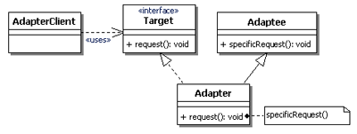 -->

#### 1.3.2. Ví dụ

- Tạo giao diện Target phù hợp cho người sử dụng

```javascript
interface Target {
    request(): string;
}
```

- Tạo lớp Adaptee chứa giao diện không phù hợp

```javascript
class Adaptee {
    specificRequest() : string {
        return ".eetpadA eht fo roivaheb laicepS";
    }
}
```

- Tạo lớp Adapter chuyển đổi giao diện sao cho phù hợp với lớp Target

```javascript
class Adapter extends Adaptee implements Target {
    constructor() {
        super();
    }
    request(){
        return "Adapter: (TRANSLATED) "+this.specificRequest().split("").reverse().join("");
    }
}
```

- Client sử dụng

```javascript
function clientCode(target: Target) {
    console.log(target.request());
}
let adaptee = new Adaptee();
console.log("Client: The Adaptee class has a weird interface. See, I don't understand it");
console.log("Adaptee: "+adaptee.specificRequest());

console.log("Client: But I can work with it via the Adapter");
let adapter = new Adapter();
clientCode(adapter);
```

- Kết quả

```
Client: The Adaptee class has a weird interface. See, I don't understand it
Adaptee: .eetpadA eht fo roivaheb laicepS
Client: But I can work with it via the Adapter
Adapter: (TRANSLATED) Special behavior of the Adaptee.
```

### 1.4. Object Adapter

Đây là một phương pháp cài đặt Adapter Pattern dựa trên ý tưởng về composition. Một lớp mới (Adapter) sẽ tham chiếu đến một (hoặc nhiều) đối tượng của lớp có sẵn với giao diện không tương thích (Adaptee), đồng thời cài đặt giao diện mà người dùng mong muốn (Target). Trong lớp mới này, khi cài đặt các phương thức của giao diện người dùng mong muốn, sẽ gọi phương thức cần thiết thông qua đối tượng thuộc lớp có giao diện không tương thích. Tiếp hợp đối tượng tránh được vấn đề đa thừa kế, không có trong các ngôn ngữ hiện đại (Java, C#). Mình khuyến khích các bạn sử dụng cách này.

#### 1.4.1. Cấu trúc Object Adapter

<!-- 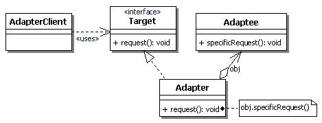 -->

#### 1.4.2. Ví dụ

- Tạo lớp Target (lớp ban đầu mà client sử dụng)

```javascript
class Target {
    request() {
        return "Target: The default target's behavior.";
    }
}
```

- Tạo lớp Adaptee chứa giao diện không phù hợp

```javascript
class Adaptee {
    specificRequest() {
        return ".eetpadA eht fo roivaheb laicepS";
    }
}
```

- Tạo lớp Adapter chuyển đổi giao diện sao cho phù hợp với lớp Target

```javascript
class Adapter implements Target {
    constructor(private obj: Adaptee) { }
    request(){
        return "Adapter: (TRANSLATED) "+this.obj.specificRequest().split("").reverse().join("");
    }
}
```

- Client sử dụng

```javascript
function clientCode(target: Target) {
    console.log(target.request());
}
let adaptee = new Adaptee();
console.log("Client: The Adaptee class has a weird interface. See, I don't understand it");
console.log("Adaptee: "+adaptee.specificRequest());

console.log("Client: But I can work with it via the Adapter");
let adapter = new Adapter(adaptee);
clientCode(adapter);
```

- Kết quả

```
Client: The Adaptee class has a weird interface. See, I don't understand it
Adaptee: .eetpadA eht fo roivaheb laicepS
Client: But I can work with it via the Adapter
Adapter: (TRANSLATED) Special behavior of the Adaptee.
```

### 1.5. Lời kết

Adapter Design pattern thực sự rất hữu ích khi bạn code với ứng dụng lớn có sử dụng nhiều API từ bên ngoài, nó giúp bạn giảm thiểu tối đa nhưng thay đổi từ nhà cung cấp API. Nhìn thì thực sự nó hơi phức tạp vì phải tạo ra nhiều lớp và interface khác nhau nhưng nếu hệ thống lớn thì nó lại có rất nhiều hữu ích.

## 2. Bridge Pattern
>
>Bridge pattern được sử dụng khi chúng ta muốn tách một lớp lớn với các tính năng phức tạp thành một lớp chính (Abstraction) và nhiều giao diện của các tính năng khác nhau (Implementation) để phát triển độc lập với nhau. Chúng được nối với nhau bởi việc lớp chính trỏ đến giao diện của các tính năng gọi là bridge (cầu nối). Nhờ đó việc chỉnh sửa Abstraction sẽ không tác động đến Implementation và ngược lại.

### 2.1. Vấn đề

Giả sử bạn có một lớp **Shape** với một cặp lớp con: **Circle** và **Square**. Bạn muốn mở rộng hệ thống phân cấp lớp này để kết hợp các màu. Tuy nhiên, vì bạn đã có hai lớp con, bạn sẽ cần tạo bốn kết hợp lớp như **BlueCircle** và **RedSquare**.
Thêm các loại hình dáng và màu sắc mới vào sẽ phát triển hệ thống phân cấp của Shape theo cấp số nhân. Ví dụ: để thêm hình tam giác (Triangle), bạn phải tạo hai lớp con, mỗi lớp cho một màu. Và sau đó, việc thêm một màu mới sẽ yêu cầu tạo ba lớp con, mỗi lớp cho một loại hình dạng. Càng mở rộng, nó càng trở nên rối rắm phức tạp.
<!-- 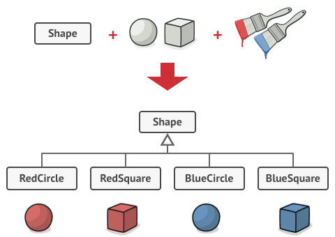 -->

Do đó chúng ta cần đến **Bridge pattern**

<!-- 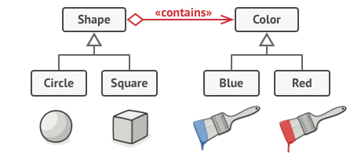 -->

### 2.2. Khi nào nên dùng Bridge pattern

- Dùng Bridge pattern khi bạn muốn phân chia và tổ chức một lớp có biến thể của các chức năng (Ví dụ: Muốn lớp có thể hoạt động với các máy chủ cơ sở dữ liệu khác nhau)
- Khi bạn cần mở rộng một lớp theo nhiều chiều trực giao (độc lập)
- Có thể chuyển đổi các Implementation trong thời gian chạy

### 2.3. Cấu trúc

<!-- 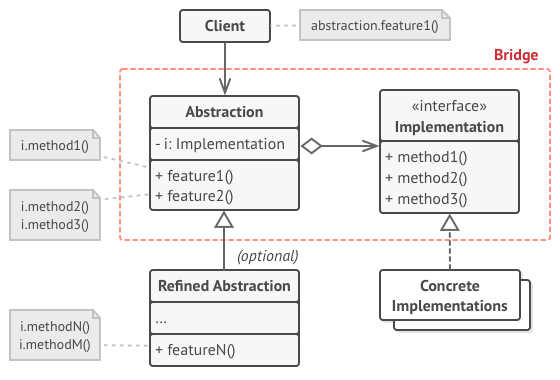 -->

- **Abstraction**: Cung cấp logic điều khiển mức cao. Nó dựa vào các đối tượng của Implementation để thực hiện các công việc cơ bản
- **Implementation**: Khai báo interface cho tính năng
- **Concrete Implementations**: Biến thể của Implementation
- **Refined Abstractions**: Biến thể của Abstraction
- **Client**: Người sử dụng khai báo Abstraction và các Implementation

### 2.4. Các bước thực hiện

- Xác định kích thước trực giao trong các lớp của bạn. Có thể là abstraction/platform, domain/infrastructure, front-end/back-end, hay interface/implementation
- Liệt kê những hoạt động nào client cần và khai báo chúng chúng trong lớp Abstraction
- Xác định các hoạt động cần thiết của các biến thể của Implementation mà Abstraction cần và khai báo chúng trong interface Implementation
- Đối với tất cả các biến thể, hãy tạo các lớp triển khai cụ thể, nhưng hãy đảm bảo tất cả chúng đều tuân theo interface Implementation.
- Trong lớp Abstraction, thêm trường tham chiếu cho kiểu Implementation. Abstraction đưa hầu hết các phương thức cần thiết cho đối tượng implementation được tham chiếu
- Nếu có một vài biến thể của Abstraction, hãy tạo các Refined Abstraction cho từng biến thể bằng cách extend lớp base Abstraction
- Client sẽ chuyển một đối tượng của Implementation vào constructor của Abstraction để liên kết chúng. Sau đó, Client không cần đụng đến Implementation nữa mà chỉ làm việc với đối tượng Abstraction thôi

### 2.5. Ví dụ

- Khai báo lớp Abstraction

```javascript
class Abstraction {
    constructor(protected iA : ImplementationA) { }
    operation() : string {
        return `Abstraction - Base operation with: \n${this.iA.operation_implementation()}`;
    }
}
```

- Tạo giao diện cho tính năng ImplementationA (một tính năng có nhiều biến thể)

```javascript
interface ImplementationA {
    operation_implementation() : string;
}
```

- Khai báo các biến thể của tính năng ImplementationA (Mở rộng theo chiều ngang)

```javascript
class ConcreteAImplementationA implements ImplementationA {
    operation_implementation() : string {
        return `Concrete A of Implementation A`;
    }
}
class ConcreteBImplementationA implements ImplementationA {
    operation_implementation() : string {
        return `Concrete B of ImplementationA`;
    }
}
```

- Client sử dụng

```javascript
function client_code(abstraction: Abstraction) {
    console.log(abstraction.operation());
}
let concreteAimplementationA = new ConcreteAImplementationA();
let abstraction = new Abstraction(concreteAimplementationA);
client_code(abstraction);
```

- Kết quả

```
Abstraction - Base operation with: 
Concrete A of Implementation A
```

- Ta có thể mở rộng class Abstraction (Mở rộng theo chiều dọc)

```javascript
class ExtendedAbstraction extends Abstraction {
    constructor(protected iA: ImplementationA) {
        super(iA);
    }
    operation() : string {
        return `ExtendedAbstraction - Extended operation with: \n${this.iA.operation_implementation()}`;
    }
}

let concreteBimplementationA = new ConcreteBImplementationA();
let extendedAbstraction = new ExtendedAbstraction(concreteBimplementationA);
client_code(extendedAbstraction);
```

- Kết quả

```
ExtendedAbstraction - Extended operation with: 
Concrete B of ImplementationA
```

## 3. Composite
>
> Composite pattern cho phép bạn làm việc với các đối tượng tương tự nhau với cấu trúc dạng cây

### 3.1. Khi nào nên dùng Composite pattern

- Khi bạn muốn xây dựng các hệ thống có cấu trúc dạng cây như sơ đồ nhân viên, danh sách bài hát...
- Khi muốn client xử lý đồng nhất cả hai yếu tố đơn giản và phức tạp thông qua một đoạn code duy nhất

### 3.2. Cấu trúc

<!-- 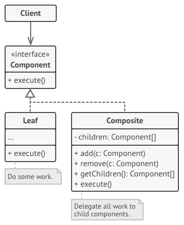 -->

Với cách kiểu thiết kế này ta chia làm 3 loại classes chính:

- **Component**: Là những base class chúng nhằm mục đích định nghĩa các interface tổng quát cho tất cả các components khác
- **Leaf**: Là những thành phần độc lập không thể phân chia ra được những component nhỏ hơn nữa
- **Composite**: Là những loại compoments còn lại nghĩa là xếp ở vị trí higher-level, hiểu một cách đơn giản là nó đóng 2 vai trò: vừa là component và cũng là tập hợp của các component

### 3.3. Cách cài đặt

- Đảm bảo rằng mô hình cốt lõi của ứng dụng có thể được biểu diễn dưới dạng cấu trúc cây. Cố gắng chia nó thành các yếu tố đơn giản và container. Hãy nhớ rằng các container phải có khả năng chứa cả các yếu tố đơn giản và các container khác
- Khai báo `Component interface` với một danh sách các phương thức có ý nghĩa cho cả các thành phần đơn giản và phức tạp
- Tạo `Leaf` class để đại diện cho các yếu tố đơn giản. Một chương trình có thể có nhiều leaf class khác nhau
- Tạo `Container` class để biểu diễn các phần tử phức tạp. Trong class này, cung cấp một trường mảng để lưu trữ các tham chiếu đến các thành phần phụ. Mảng phải có khả năng lưu trữ cả lá và Container, vì vậy hãy chắc chắn rằng nó được khai báo với Component interface
- Cuối cùng, viết các phương thức để thêm và loại bỏ các phần tử con trong container

### 3.4. Ví dụ

- Tạo interface cho Component

```js
class Employee {
    private subordinates: Array<Employee>;
    constructor(
        private name: string,
        private dept: string,
        private salary: number
    ) {
        this.subordinates = new Array<Employee>();
    }
    add(e: Employee): void {
        this.subordinates.push(e);
    }
    remove(e: Employee): void {
        this.subordinates.splice(this.subordinates.indexOf(e), 1);
    }
    getChildren(): Array<Employee> {
        return this.subordinates;
    }
    toString(): string {
        return (`Employee :[ Name : ${this.name}, dept : ${this.dept}, salary : ${this.salary} ]`);
    }
}
```

- Triển khai Component và thêm các node cho cây (các nhân viên), với người đứng đầu là CEO

```js
let CEO: Employee = new Employee("John", "CEO", 30000);
let headSales : Employee = new Employee("Robert", "Head Sales", 20000);
let headMarketing : Employee = new Employee("Michel", "Head Marketing", 20000);

let clerk1 : Employee = new Employee("Laura", "Marketing", 10000);
let clerk2 : Employee = new Employee("Bob", "Marketing", 10000);

let salesExecutive1 : Employee = new Employee("Richard", "Sales", 10000);
let salesExecutive2 : Employee = new Employee("Rob", "Sales", 10000);

CEO.add(headSales);
CEO.add(headMarketing);

headSales.add(salesExecutive1);
headSales.add(salesExecutive2);

headMarketing.add(clerk1);
headMarketing.add(clerk2);

//print all employees of the organization
console.log(CEO);
for (let headEmployee of CEO.getChildren()) {
    console.log(headEmployee);
    for (let employee of headEmployee.getChildren())
        console.log(employee);
}
```

- Kết quả

```
Employee :[ Name : John, dept : CEO, salary : 30000 ]
Employee :[ Name : Robert, dept : Head Sales, salary : 20000 ]
Employee :[ Name : Richard, dept : Sales, salary : 10000 ]
Employee :[ Name : Rob, dept : Sales, salary : 10000 ]
Employee :[ Name : Michel, dept : Head Marketing, salary : 20000 ]
Employee :[ Name : Laura, dept : Marketing, salary : 10000 ]
Employee :[ Name : Bob, dept : Marketing, salary : 10000 ]
```

## 4. Decorator
>
> Decorator thường được dùng khi ta muốn thêm chức năng cho một đối tượng đã tồn tại trước đó, mà không muốn ảnh hưởng đến các đối tượng khác

### 4.1. Vấn đề

Đôi khi chúng ta cần mở rộng một phương thức trong đối tượng, và cách thông thường là chúng ta sẽ kế thừa đối tượng đó. Nhưng trong một vài trường hợp sẽ làm cho mã nguồn trở lên phức tạp hơn chúng ta mong muốn. Do đó ta cần sử dụng đến Decorator Pattern để mở rộng phương thức một cách linh hoạt.

### 4.2. Khác biệt giữa mở rộng phương thức theo cách linh động với mở rộng theo cách tĩnh

- Mở rộng theo cách tĩnh: Chúng ta thường kế thừa lại class đó và mở rộng một cách cứng nhắc, vì cách mở rộng đó đã áp dụng cho class kế thừa đó rồi nên khi cần mở rộng thêm ta lại phải kế thừa (nếu muốn lược bỏ bớt tính năng ta cũng phải làm thế), khiến hệ thống trở nên phức tạp
- Mở rộng theo cách động: Mở rộng theo cách linh động là chúng ta sẽ cung cấp một cơ cấu mà cơ cấu này cho phép chúng ta thay đổi một đối tượng đã tồn tại nhưng không làm ảnh hưởng đến các đối tượng khác của cùng lớp đó

### 4.3. Ví dụ

Tưởng tượng rằng bạn đang làm việc cho một cửa hàng bánh **Pizza**, cửa hàng của bạn vừa làm **pizza cà chua** và **pizza phô mai**. Sau đó bạn cần đặt thêm một vài nguyên liệu nữa lên phần trên của bánh vì khách hàng có quyền lựa chọn thêm gà hoặc tiêu cho chiếc bánh của họ. Về cơ bản bạn có một số loại pizza như: **pizza gà cà chua**, **pizza cà chua hạt tiêu**, **pizza gà phô mai**, **pizza phô mai hồ tiêu**, **pizza cà chua gà hồ tiêu** và **phô mai gà hồ tiêu**. Nếu chúng ta giải quyết vấn đề này với cách mở rộng tĩnh thì bạn sẽ cần tạo ra một số lượng lớn các lớp như **TomatoChickenPizza**, **TomatoPepperPizza**... nó có nghĩa là một số lượng lớn các kết hợp sẽ bị thêm vào. Do đó chúng ta cần giải quyết theo cách động.

### 4.4. Cấu trúc

<!-- 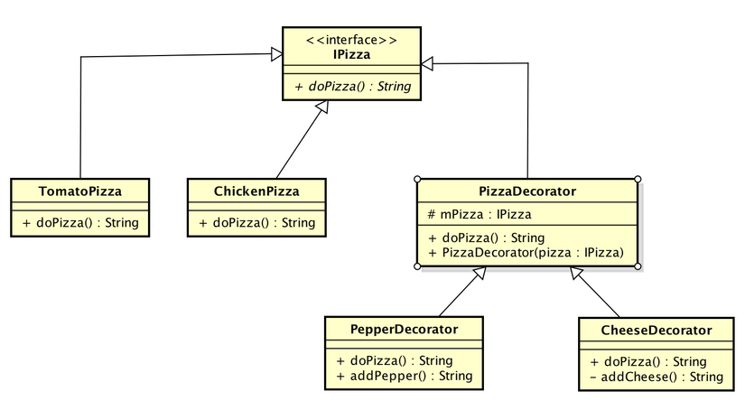 -->

Những thành phần trong mẫu thiết kế Decorator:

- **Component (IPizza)**: Giao diện (interface) chung được dùng để triển khai các đối tượng
- **ConcreteComponent (TomatoPizza, ChickenPizza)**: Các đối tượng triển khai giao diện Component
- **Decorator (PizzaDecorator)**: Lớp trừu tượng có duy trì một tham chiếu đến đối tượng gốc và đồng thời cài đặt các phần cần thiết cho Decorator
- **ConcreteDecorator (PepperDecorator, CheeseDecorator)**: Một cài đặt của Decorator, nó cài đặt các phần mở rộng cho đối tượng được đưa vào

### 4.5. Thực hành

- Tạo giao diện Component (IPizza):

```javascript
interface IPizza {
    doPizza() : string;
}
```

- Tạo ra 2 concrete của Component:

```javascript
class TomatoPizza implements IPizza {
    doPizza(): string {
        return "I am a Tomato Pizza";
    }
}
class ChickenPizza implements IPizza {
    doPizza(): string {
        return "I am a Chicken Pizza";
    }
}
```

- Tạo ra một lớp trừu tượng Decorator làm xương sống cho các concrete Decorator khác

```javascript
abstract class PizzaDecorator implements IPizza {
    constructor(protected mPizza: IPizza) { }

    getPizza(): IPizza {
        return this.mPizza;
    }

    setPizza(mPizza: IPizza): void {
        this.mPizza = mPizza;
    }

    abstract doPizza(): string;
}
```

- Tạo ra 2 concrete của Decorator là **PepperDecorator** và **CheeseDecorator** và cài đặt các phương thức mở rộng. Ví dụ PepperDecorator sẽ thêm tiêu vào pizza. Tính năng mở rộng là được cài đặt trong phương thức **addPepper()**

```javascript
class CheeseDecorator extends PizzaDecorator {
    constructor(pizza: IPizza) {
        super(pizza);
    }

    doPizza(): string {
        let type: string = this.mPizza.doPizza();
        return type + this.addCheese();
    }

    // This is additional functionality
    // It adds cheese to an existing pizza
    addCheese(): string {
        return " + Cheese";
    }
}
class PepperDecorator extends PizzaDecorator {
    constructor(pizza: IPizza) {
        super(pizza);
    }

    doPizza(): string {
        let type: string = this.mPizza.doPizza();
        return type + this.addPepper();
    }

    // This is additional functionality
    // It adds cheese to an existing pizza
    addPepper(): string {
        return " + Pepper";
    }
}
```

- Và cuối cùng sử dụng Decorator để thêm tính năng (tiêu, sốt) cho Pizza

```javascript
let tomato : IPizza = new TomatoPizza();
let chicken : IPizza = new ChickenPizza();

console.log(tomato.doPizza());
console.log(chicken.doPizza());

// Use Decorator pattern to extend existing pizza dynamically
// Add pepper to tomato-pizza
let pepperDecorator : PepperDecorator = new PepperDecorator(tomato);
console.log(pepperDecorator.doPizza());

// Add cheese to tomato-pizza
let cheeseDecorator : CheeseDecorator = new CheeseDecorator(tomato);
console.log(cheeseDecorator.doPizza());

// Add cheese and pepper to tomato-pizza
// We combine functionalities together easily.
let cheeseDecorator2 : CheeseDecorator = new CheeseDecorator(pepperDecorator);
console.log(cheeseDecorator2.doPizza());
```

- Kết quả

```
I am a Tomato Pizza
I am a Chicken Pizza
I am a Tomato Pizza + Pepper
I am a Tomato Pizza + Cheese
I am a Tomato Pizza + Pepper + Cheese
```

## 5. Facade
>
> Bao bọc một hệ thống con phức tạp với một giao diện đơn giản

### 5.1. Ưu điểm của Facade Pattern?

- Giúp cho một thư viện của bạn trở nên đơn giản hơn trong việc sử dụng và đọc hiểu
- Giảm sự phụ thuộc của các mã code bên ngoài với code bên trong của thư viện, vì hầu hết các code đều dùng Facade, vì thế cho phép sự linh động trong phát triển các hệ thống
- Đóng gói tập nhiều hàm API được thiết kế không tốt bằng một hàm API có thiết kế tốt hơn

### 5.2. Vấn đề

Giả sử bạn có chuỗi các hành động được thực hiện theo thứ tự, và các hành động này lại được yêu cầu ở nhiều nơi trong phạm vi ứng dụng của bạn, vậy mỗi lúc bạn cần dùng đến nó bạn lại phải copy-paste hoặc viết lại đoạn code đó vào những nơi cần sử dụng trong ứng dụng. Điều này có vẻ ok, copy cũng nhanh nên chẳng sao, nhưng nếu bỗng nhiên làm xong bạn nhận ra cần phải thay đổi lại cấu trúc và mã xử lý trong hầu hết chuỗi hành động đó, vậy bạn sẽ làm gì ?
Đây chính là mấu chốt của vấn đề, bạn sẽ lại đi lục lại đoạn code đó ở tất cả các nơi, rồi lại sửa nó. Điều này quá tốn thời gian và hơn nữa dường như bạn đang mất đi sự kiểm soát các đoạn mã của mình và trong quá trình đó còn có nguy cơ phát sinh lỗi. Do vậy ta cần dùng đến Facade Pattern.

### 5.3. Giải pháp

Những gì bạn cần phải làm chỉ là thiết kế một Facade, và trong đó phương thức facade sẽ xử lý các đoạn code dùng đi dùng lại. Từ xu hướng quan điểm trên, chúng ta sẽ chỉ cần gọi Facade để thực thi các hành động dựa trên các parameters được cung cấp.
Bây giờ nếu chúng ta cần bất kỳ thay đổi nào trong quá trình trên, công việc sẽ đơn giản hơn rất nhiểu, chỉ cần thay đổi các xử lý trong phương thức facade của bạn và mọi thứ sẽ được đồng bộ thay vì thực hiện sự thay đổi ở những nơi sử dụng cả chuỗi các mã code đó.

### 5.4. Cấu trúc

<!--  -->

Các subsystem bên trong Facade cũng sử dụng Facade.

### 5.5. Ví dụ

Hãy cùng xét một ví dụ khi người dùng mua hàng online trên trang web của bạn. Một quá trình kiểm tra đơn giản bao gồm các bước sau:

- Thêm sản phẩm vào giỏ hàng
- Tính toán chi phí vận chuyển
- Tính toán tiền chiết khấu
- Tạo đơn đặt hàng

```javascript
// Xử lý checkout
let productId = "123456";
let product = Product.find(productId);
if(product.length > 0) {
    // Thêm vào giỏ hàng
    let cart = new Cart();
    cart.addItem(product);
    // Tính phí ship hàng
    let shipping = new ShippingCharge(product);
    shipping.calculateCharge();
    // Tính mã giảm giá
    let discount = new Discount(product);
    discount.applyDiscount();
    // Tạo mã đơn hàng
    let order = new Order();
    order.generateOrder();
    ...
}
```

- Giả sử bạn sử dụng đoạn mã trên để xử lý đặt hàng của người dùng, có rất nhiều object sử dụng để hoàn thành chuỗi xử lý order nên việc mỗi nơi trong ứng dụng cần chuỗi xử lý này lại bê đoạn code này theo là điều hoàn toàn không nên làm
- Vậy chúng ta thử áp dụng Facade vào ví dụ trên

```javascript
class OrderFacade {
        private product: any;
        constructor(productId: string) {
            this.product = Product.find(productId);
        }
        generateOrder() {
            // Xử lý toàn bộ logic
            if(this.checkQuantity()) {
                this.addToCart();
                this.calulateShipping();
                this.applyDiscount();
                this.placeOrder();
            }

        }
        private addToCart () {
            let cart : Cart = new Cart();
            cart.addItem(this.product);
        }
        private checkQuantity() {
            return this.product.length != 0 ? true : false;
        }
        private function calulateShipping() {
            let shipping : ShippingCharge = new ShippingCharge(this.product);
            shipping.calculateCharge();
        }
        private applyDiscount() {
            let discount : Discount = new Discount();
            discount.applyDiscount(this.product);
        }
        private placeOrder() {
            let order : Order = new Order();
            order.generateOrder();
        }
    }
```

- Sử dụng

```javascript
let productId = "123456";
let order = new OrderFacade(productId);
order.generateOrder();
```

Như vậy đoạn mã phức tạp trên đã được gói gọn trong phương thức **generateOrder** và giờ mỗi khi chúng ta có thay đổi không cần phải lục lại những đoạn code như trong ví dụ ban đầu mà chỉ cần thay đổi xử lý trong Facade, và cũng không cần đem cả đoạn code dài ban đầu đi sử dụng khi cần, mà chỉ cần gọi method **generateOrder()**.

### 5.6. Kết

Facade Pattern chỉ nên thực hiện trong tình huống mà bạn cần một interface duy nhất để hoàn thành nhiều nhiệm vụ, tưởng tượng giống như bạn có một thư ký và cô ấy sẽ lên kế hoạch công việc theo trình tự giống như cách một Facade object làm để giúp bạn hoàn thành nhiều nhiệm vụ.

## 6. Proxy
>
> Proxy cung cấp một class ảo đứng trước class thực sự mà chúng ta muốn làm việc để xử lí, tăng thêm tính bảo mật và cải thiện performance cho hệ thống khi xử lí dữ liệu liên quan đến class mà chúng ta làm việc

### 6.1. Khi nào nên sử dụng Proxy Pattern?

- Khi muốn thêm một số bước bảo mật, quản lí sự truy cập/truy xuất dữ liệu ra vào đối tượng
- Linh hoạt cách truy xuất/truy cập dữ liệu (Lazy Loading,...)

### 6.2. Các loại ứng dụng của Proxy Pattern

- **Remote Proxy**: Cung cấp một đại diện cho object nhưng nằm trong 1 địa chỉ khác
- **Virtual Proxy**: Áp dụng cho các dữ liệu tốn nhiều chi phí khởi tạo, loại proxy này cung cấp các phương pháp lấy dữ liệu linh hoạt, chỉ thực sự khởi tạo/truy xuất dữ liệu khi được người dùng yêu cầu thay vì khởi tạo dữ liệu từ đầu. Một số ứng dụng như Lazy Loading,...
- **Protective Proxy**: Kiểm soát quyền truy cập vào object gốc. Loại proxy này tạo thêm các hàng rào kiểm soát nhằm đảo bảo bảo mật cho object
- **Smart Proxy**: Bổ sung thêm các hành động, phần mở rộng khi truy cập/truy xuất dữ liệu trong đối tượng

### 6.3. Cấu trúc

<!-- 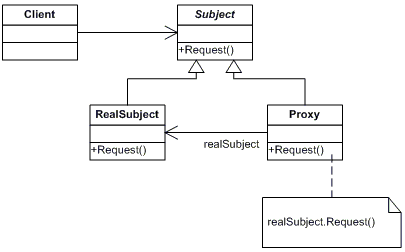 -->

Các đối tượng tham gia vào Proxy Pattern:

- **Subject**: Interface giữ vai trò tạo xương sống cho **RealSubject** (đối tượng thực sự) và **Proxy**
- **RealSubject**: Đối tượng thực sự mà người dùng làm việc
- **Proxy**: Triển khai xương sống từ **Subject** và là class đứng trước (đại diện) **RealSubject** nhằm thực hiện các tiền/hậu xử lí, bảo mật cho **RealSubject**. Proxy duy trì một tham chiếu đến đối tượng của **RealSubject** nhằm truy cập/truy xuất dữ liệu

### 6.4. Ví dụ

- Tạo interface **IItem** và class **Item** triển khai interface đó
- **Item** là một class không tốn nhiều chi phí khởi tạo đối tượng nhưng giá trị **content** bên trong Item lại tốn nhiều chi phí khởi tạo (tưởng tượng rằng mỗi khi muốn lấy giá trị content thì phải request lên server để lấy giá trị, điều đó gây nên chi phí, thời gian kết nối đến server, có thể xem đối tượng IItem là index/id của giá trị content)

```js
interface IItem {
    delaytoResponseContent(): Promise<number>;
    content: number;
}

class Item implements IItem {
    // Giá trị của content nằm trên server
    protected _content: number = Math.round(Math.random() * 10);
    get content() {
        return this._content;
    }
    set content(n: number) {
        this._content = n;
    }
    
    // Trả về giá trị của content mất nhiều chi phí
    async delaytoResponseContent() : Promise<number> {
        await this.sleep(1000);
        return this.content;
    }
    
    // Tạo chi phí kết nối
    sleep(ms: number) {
        return new Promise((resolve) =>
            setTimeout(resolve, ms)
        )
    }
}
```

- Tạo interface **Subject** và class **RealSubject**, **Proxy**

```js
interface Subject {
    data: Array<IItem>;
    Request(index: number): any;
}

class RealSubject {
    constructor(private _data: Array<IItem>) { }
    get data() : Array<IItem> {
        return this._data;
    }

    Request(index: number) : Promise<number> {
        return this.data[index].delaytoResponseContent();
    }
}

class SubjectProxy implements Subject {
    // Khai báo cho đúng cấu trúc nhưng không sử dụng
    data!: Array<IItem>;
    // Duy trì một kết nối đến RealSubject để xử lí dữ liệu
    private realSubject!: RealSubject;

    // Kết nối đến host thông qua RealSubject
    constructor(data: Array<IItem>) {
        this.realSubject = new RealSubject(data);
    }

    // - Ghi đè lại phương thức Request
    // - Thay vì lấy về giá trị content mất nhiều chi phí
    //   thì ta chỉ lấy về index/id của giá trị đó
    // - Khi nào người dùng cần giá trị content thì mới
    //   sử dụng phương thức delaytoResponseContent để
    //   lấy giá trị content về
    Request(index: number) : IItem {
        return this.realSubject.data[index];
    }
}
```

- Tạo một host giả có chứa và index Item

```js
// Tạo một host giả có chứa content và index Item
let data : Array<IItem> = [
    new Item(),
    new Item(),
    new Item(),
    new Item(),
    new Item(),
    new Item(),
];
```

- Khi không sử dụng Proxy. Giả sử đường truyền yếu chỉ có thể tại được 1 content 1 lần và ta phải tải hết dữ liệu về để hiển thị trong khi người dùng muốn xem dữ liệu thứ 4 trước tiên

```js
let realSubject = new RealSubject(data);
(async () => {
    let wanted : number = 3;
    for(let i = 0; i < 5; i++) {
        await realSubject.Request(i).then(
            res => {
                if(i!=wanted)
                    console.log("Result: "+res)
                else
                    console.log("Wanted result: "+res)
            }
        );
    }
})();
```

- Kết quả khi không dùng Proxy

```js
Result: 4
Result: 5
Result: 5
Wanted result: 4
Result: 9
```

- Khi sử dụng Proxy và ứng dụng Lazy Loading (Virtual Proxy). Dữ liệu cần thiết sẽ được tải trước, các dữ liệu còn lại sẽ được tải sau

```js
let proxy = new SubjectProxy(data);
(async () => {
    let wanted : number = 3;
    let results : Array<IItem> = new Array<IItem>();
    for(let i = 0; i < 5; i++) {
        results.push(proxy.Request(i));
        if(i==wanted)
            results[i].delaytoResponseContent()
                .then(res => console.log("Wanted result via proxy: "+res));
    }
    for(let i = 0; i < 5; i++)
        if(i!=wanted)
            results[i].delaytoResponseContent()
                .then(res => console.log("Result via proxy: "+res))
})();
```

- Kết quả khi sử dụng Proxy

```js
Wanted result via proxy: 1
Result via proxy: 0
Result via proxy: 7
Result via proxy: 2
Result via proxy: 1
```

- Ngoài ra ta có thể cài đặt thêm các tính năng bảo mật, kiểm tra lỗi cho proxy để tăng tính bảo mật hơn cho hệ thống (Proxy Smart)

### 6.5. So sánh với pattern cùng loại (Structural Pattern)

Ta có thể thấy Proxy Pattern khá giống với **Adapter Patern** và **Decorator Pattern** nên ta cần phân biệt chúng:

- Khác với **Adapter Pattern**: Thông thường mẫu Adapter cung cấp một giao diện khác với đối tượng gốc, còn Proxy cung cấp cùng một giao diện giống như đối tượng gốc
- Khác với **Decorator Pattern**: Có thể cài đặt tương tự như Proxy, nhưng Decorator được dùng cho mục đích khác. Decorator bổ sung thêm nhiều nhiệm vụ cho một đối tượng nhưng ngược lại Proxy điều khiển truy cập đến một đối tượng. Proxy tuỳ biến theo nhiều cấp khác nhau mà có thể được cài đặt giống như một Decorator:
  - **Protection Proxy, Smart Proxy**: Có thể được cài đặt như một Decorator
  - **Remote Proxy**: Sẽ không tham chiếu trực tiếp đến đối tượng thực sự tham chiếu gián tiếp, giống như ID của host và địa chỉ trên host vậy
  - **Virtural Proxy**: Tham chiếu gián tiếp chẳng hạn như tên file, index và sẽ tham chiếu trực tiếp khi cần thiết

## 7. Flyweight
>
>Được dùng như một object chia sẻ, có thể được sử dụng đồng thời ở nhiều ngữ cảnh khác nhau, hoạt động như một đối tượng độc lập tại mỗi ngữ cảnh. Mỗi đối tượng cụ thể sẽ tham chiếu đến cùng một instance được chia sẻ ở trong pool của Flyweight object

### 7.1. Vấn đề

Bạn có ý tưởng xây dựng một trò chơi bắn súng sinh tồn tương tự như PUBG. Nhưng sau khi hoàn thành, bạn push commit, build trò chơi và gửi nó cho bạn của bạn để chơi thử, nhưng trò chơi liên tục bị sập sau vài phút chơi. Sau khi dành vài giờ để đào bới các bản error log, bạn phát hiện ra rằng trò chơi đã bị sập vì không đủ RAM do vấn đề liên quan đến hệ thống con! Mỗi hệ thống con, chẳng hạn như một viên đạn, một tên lửa hoặc một mảnh đạn được đại diện bởi một đối tượng riêng biệt chứa nhiều dữ liệu. Tại một số thời điểm, khi cuộc chiến bước vào giai đoạn căng thẳng, các mảnh đạn, tên lửa mới được tạo ra liên tục cho đến khi RAM không thể chứa được nữa. Do đó trò chơi bị sập.

<!-- 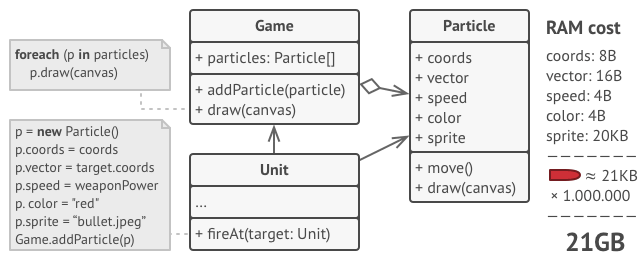 -->

### 7.2. Giải quyết

Khi kiểm tra kỹ hơn lớp **Particle** (hệ thống con), bạn có thể nhận thấy rằng các trường *color* và *sprite* sử dụng nhiều bộ nhớ hơn các trường khác. Điều tệ hơn nữa là hai trường này lưu trữ dữ liệu gần như giống hệt nhau trên tất cả các đối tượng **(Intrinsic state)**. Ví dụ, tất cả các viên đạn có cùng color và sprite và chỉ khác giá trị ở các trường coord, vector và speed **(Extrinsic state)**.

- **Intrinsic state (trạng thái nội tại)**: Dữ liệu không đổi của một đối tượng
- **Extrinsic state (trạng thái bên ngoài)**: Trạng thái của đối tượng, thường thay đổi trong từng ngữ cảnh khác nhau

Cách giải quyết cho vấn đề này là bạn nên ngừng lưu trữ *extrinsic state* bên trong đối tượng. Thay vào đó, bạn nên chuyển các state này sang các phương thức cụ thể, sao cho chỉ còn *intrinsic state* được lưu trong đối tượng và sử dụng lại các đối tượng này (chứa *intrinsic state*) kết hợp với các *extrinsic state* trong từng ngữ cảnh để tiết kiệm bộ nhớ nhưng vẫn đảm bảo đối tượng có đầy đủ các state như một đối tượng thông thường. Đối tượng khi được loại bỏ các *extrinsic state* và chỉ giữ lại các *intrinsic state* được gọi là **flyweight**.

*Lưu ý: Vì đối tượng *flyweight* được sử dụng lại trong nhiều ngữ cảnh khác nhau thế nên bạn phải chắc rằng các thuộc tính bên trong flyweight không được sửa đổi. Một flyweight chỉ nên khởi tạo các thuộc tính một lần.*

<!-- 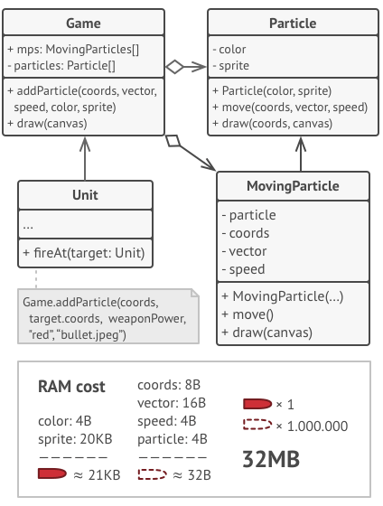 -->

Quay lại vấn đề, giả sử rằng có ba loại hệ thống con trong trò chơi: viên đạn, tên lửa và mảnh đạn. Chúng được tạo ra rất nhiều trong game nên ta cần phải tối ưu nó. Và sau khi loại bỏ các trường *extrinsic state* ra khỏi các lớp của chúng (biến chúng thành *flyweight*), vậy còn *extrinsic state* được chuyển đến đâu? Vì nó là trạng thái riêng của từng đối tượng nên ta vẫn phải lưu trữ nó đúng không? Trong hầu hết trường hợp, *extrinsic state* đưa vào **Container** - nơi tổng hợp và quản lí các *extrinsic state* và *flyweight*, Container trong ví dụ này là lớp **Game**. Để đưa *extrinsic state* vào Container, bạn cần đưa vào thông qua đối tượng của lớp **Context**. Bên trong Context chứa:

- *Extrinsic state*
- Một tham chiếu đến đối tượng *flyweight* phù hợp với *extrinsic state*

Ngoài ra để quản lí và truy nhập/xuất các *flyweight* một cách tốt hơn, chúng ta sử dụng **FlyweightFactory** để quản lí các *flyweight* thay cho sử dụng mảng (trong ví dụ là mảng *particles*).

- **FlyweightFactory**: Nhận đầu vào là các *intrinsic state*, sau đó tìm kiếm đối tượng *flyweight* phù hợp, nếu tìm thấy thì trả về *flyweight* đó, nếu không tìm thấy, nó sẽ tạo ra một *flyweight* mới.

### 7.3. Khi nào nên sử dụng Flyweight Pattern?

Chỉ sử dụng Flyweight Pattern khi chương trình phải chứa một số lượng lớn các đối tượng gần giống nhau trong khi bạn muốn tối ưu bộ nhớ.

### 7.4. Cấu trúc

<!-- 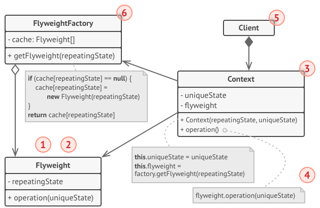 -->

Các thành phần của Flyweight Pattern:

- **Flyweight**: Chứa các *intrinsic state*
- **FlyweightFactory**: Quản lí các *Flyweight*
- **Context**: Chứa *extrinsic state* và một tham chiếu đến *flyweight* phù hợp nằm trong FlyweightFactory
- **Client**: Đóng vai trò như Container. Client quản lí các FlyweightFactory và Context

### 7.5. Cài đặt Flyweight Pattern

- Chia các trường của một lớp sẽ trở thành một *flyweight* thành hai phần: *intrinsic state* và *extrinsic state*
- Để lại các trường đại diện cho *intrinsic state* trong lớp và chắc chắn rằng chúng chỉ có giá trị khi khởi tạo và không thay đổi
- Loại bỏ các trường *extrinsic state*. Thay chúng bằng các phương thức đại diện với tham số truyền vào là các giá trị của trường *extrinsic state*
- (Tùy chọn) Tạo một lớp Factory để quản lý các *flyweight* và chỉ truy cập các vào các *flyweight* thông qua Factory
- Tạo lớp Client để lưu trữ FlyweightFactory và các *extrinsic state* cùng với trường tham chiếu tới *flyweight* phù hợp trong các context

### 7.6. Thực hành

- Đầu tiên chúng ta tạo lớp **Flyweight** (lớp này được các lớp khác chỉa vào nhiều nhất nên ta bắt đầu từ đây :D)

```js
class Flyweight {
    constructor(
        public model: string,
        public processor: string
    ) { }
    operation(memory: number, tag: string) {
        return `Computer: Model = ${this.model}, Proccessor = ${this.processor}, Memory = ${memory}, Tag = ${tag}`;
    }
}
```

- Tiếp đến là **FlyweightFactory** để quản lí các Flyweight

```js
class FlyWeightFactory {
    constructor() { }
    // Quản lí các flyweight
    public cache: any = {};
    getFlyweight(
        model: string,
        processor: string
    ) {
        if (!this.cache[model + processor]) {
            this.cache[model + processor] =
                new Flyweight(model, processor);
        }
        return this.cache[model + processor];
    }
    count() {
        var count = 0;
        for (var f in this.cache) count++;
        return count;
    }
}
```

- Tạo lớp **Context** nhằm đồng bộ *intrinsic state* trong flyweight với *extrinsic state* bên ngoài thông qua một con trỏ tham chiếu đến flyweight phù hợp

```js
class Context {
    constructor(
        public flyweight: Flyweight,
        public memory: number, // Unique state
        public tag: string // Unique state
    ) { }
    operation() {
        return this.flyweight.operation(this.memory, this.tag);
    }
}
```

- Cuối cùng là lớp **Client** đóng vai trò như một lớp **Container**

```js
class Client {
    constructor() {}
    public flyweightFactory : FlyWeightFactory = new FlyWeightFactory();
    public contexts : Array<Context> = new Array<Context>();
    public countContext : number = 0;
    add(
        model: string, 
        processor: string, 
        memory: number, 
        tag: string
    ) {
        this.contexts.push(
            new Context(
                this.flyweightFactory.getFlyweight(
                    model, processor
                ),
                memory, tag
            )
        );
        this.countContext++;
    }
    getContext(
        model: string, 
        processor: string, 
        memory: number, 
        tag: string
    ) {
        return this.flyweightFactory.getFlyweight(
            model, processor
        ).operation(memory, tag);
    }
    getCountContext() {
        return this.countContext;
    }
}
```

- Sử dụng Flyweight Pattern. Đầu tiên ta thử thêm vào các máy tính có *model* và *proccessor* tương tự nhau

```js
var computers = new Client();

computers.add("Studio XPS", "Intel", 5, "Y755P");
computers.add("Studio XPS", "Intel", 6, "X997T");
computers.add("Studio XPS", "Intel", 2, "U8U80");
computers.add("Studio XPS", "Intel", 2, "NT777");
computers.add("Studio XPS", "Intel", 2, "0J88A");
computers.add("Envy", "Intel", 4, "CNU883701");
computers.add("Envy", "Intel", 2, "TXU003283");

console.log("Computer counting: " + computers.getCountContext());
console.log("Flyweight counting: " + computers.flyweightFactory.count());
```

- Kết quả

```
Computer counting: 7
Flyweight counting: 2
```

- Vì Flyweight Pattern sử dụng con trỏ để tiết kiệm bộ nhớ cho các *intrinsic state* nên ta phải cẩn thận không nên sửa đổi các *instrinsic state* vì nó sẽ dẫn đến thay đổi toàn bộ các context. Ví dụ mình sẽ thay đổi *proccessor* (*intricsic state*) của các máy tính *Studio XPS Intel* thành *Studio XPS AMD* thông qua việc chỉnh sửa flyweight trong FlyweightFactory

```js
console.log("Before changes: ")
for(let [k, v] of computers.contexts.entries()) {
    console.log(`(${k+1}) => `+v.operation());
}

computers.flyweightFactory
    .getFlyweight("Studio XPS", "Intel").processor = "AMD";

console.log("After changes: ")
for(let [k, v] of computers.contexts.entries()) {
    console.log(`(${k+1}) => `+v.operation());
}
```

- Kết quả

```
Before changes: 
(1) => Computer: Model = Studio XPS, Proccessor = Intel, Memory = 5, Tag = Y755P
(2) => Computer: Model = Studio XPS, Proccessor = Intel, Memory = 6, Tag = X997T
(3) => Computer: Model = Studio XPS, Proccessor = Intel, Memory = 2, Tag = U8U80
(4) => Computer: Model = Studio XPS, Proccessor = Intel, Memory = 2, Tag = NT777
(5) => Computer: Model = Studio XPS, Proccessor = Intel, Memory = 2, Tag = 0J88A
(6) => Computer: Model = Envy, Proccessor = Intel, Memory = 4, Tag = CNU883701
(7) => Computer: Model = Envy, Proccessor = Intel, Memory = 2, Tag = TXU003283
After changes: 
(1) => Computer: Model = Studio XPS, Proccessor = AMD, Memory = 5, Tag = Y755P
(2) => Computer: Model = Studio XPS, Proccessor = AMD, Memory = 6, Tag = X997T
(3) => Computer: Model = Studio XPS, Proccessor = AMD, Memory = 2, Tag = U8U80
(4) => Computer: Model = Studio XPS, Proccessor = AMD, Memory = 2, Tag = NT777
(5) => Computer: Model = Studio XPS, Proccessor = AMD, Memory = 2, Tag = 0J88A
(6) => Computer: Model = Envy, Proccessor = Intel, Memory = 4, Tag = CNU883701
(7) => Computer: Model = Envy, Proccessor = Intel, Memory = 2, Tag = TXU003283
```

## 8. Delegate
>
> Loại bỏ các chức năng phức tạp từ class chính bằng cách đưa chúng vào class khác xử lí

### 8.1. Vấn đề

Chúng ta cùng xem một ví dụ rất thực tế sau về Delegate, để vận chuyển hàng chúng ta có thể vận chuyển bằng xe khách, tàu hỏa và máy bay, mỗi loại vận chuyển một loại hàng hóa khác nhau, các hàng nhẹ và cần gấp thì vận chuyển bằng hàng không, hàng cồng kềnh và cần vận chuyển nhanh dùng xe khách, hàng có thể vận chuyển chậm dùng tàu hỏa. Như vậy bạn có 3 class là **RailShipper**, **BusShipper** và **PlaneShipper**, cả ba class này đều có phương thức vận chuyển *delivery*, thông thường chúng ta cần phải qua các bước xử lí điều kiện để lựa chọn được loại hình vận chuyển. Nhưng dần rồi càng nhiều loại mô hình vận chuyển được thêm vào và chúng ta phải code nhiều hơn là cho class phình ra và trở nên phức tạp.

### 8.2. Giải quyết

Do đó để tối ưu class chúng ta sẽ đưa các bước lựa chọn phương thức vận chuyển vào lớp **ShipperHandler** để xử lí, lớp này sẽ giúp bạn gọi phương thức *delivery* phù hợp cho kiện hàng của bạn.

### 8.3. Cấu trúc

<!-- 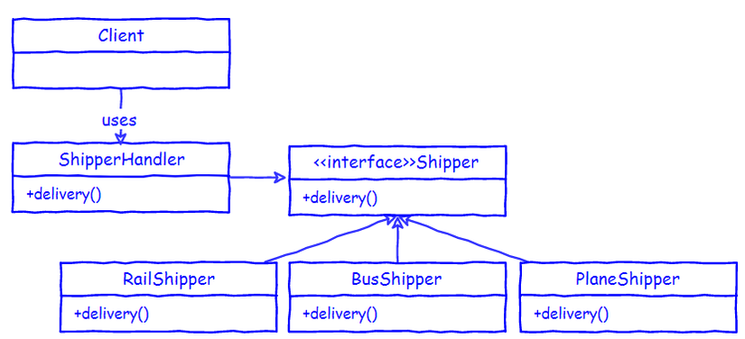 -->

Các thành phần tham gia vào Delegate Pattern:

- **Shipper**: interface làm xương sống cho các loại hình vận chuyển
- **RailShipper, BusShipper, PlaneShipper**: Các loại hình vận chuyển triển khai từ Shipper
- **ShipperHandler**: Triển khai từ interface Shipper chúng ta sẽ đưa các code xử lí vào trong class này

### 8.4. Thực hành

```js
interface Shipper {
    delivery(): string;
}

class RailShipper implements Shipper {
    delivery() {
        return `Package is delivering by train`;
    }
}

class BusShipper implements Shipper {
    delivery() {
        return `Package is delivering by bus`;
    }
}

class PlaneShipper implements Shipper {
    delivery() {
        return `Package is delivering by plane`;
    }
}

class ShipperHandler implements Shipper {
    private shipper!: Shipper;
    constructor(type: string) {
        this.shipper = eval(`new ${type}Shipper();`);
    }
    delivery() {
        return this.shipper.delivery()
    }
}

let shipper: Shipper = new ShipperHandler('Bus');
console.log(shipper.delivery());
```

- Kết quả

```
Package is delivering by bus
```

### 8.5. Lời kết

**Delegate Pattern** có nhiều điểm giống với kế thừa trong lập trình hướng đối tượng nhưng nó được mở rộng hơn, nó cũng có những điểm tương đồng với **Proxy Pattern** tuy nhiên mỗi pattern hữu ích trong những tình huống khác nhau. Các Design Pattern giúp cho bạn phát triển ứng dụng nhanh hơn với kinh nghiệm được đúc kết trong các pattern sẽ giải quyết được nhiều vấn đề chung. Việc sử dụng các Desgin Pattern cũng cần linh hoạt, không áp dụng dập khuôn, cứng nhắc để có hiệu quả cao nhất.

## 9. Entity-Attribute-Value (EAV)
>
> Entity-Attribute-Value Pattern viết tắt là EAV Pattern, là 1 mô hình dữ liệu, làm việc với các thực thể (entity) có số lượng các thuộc tính (attribute) có thể mở rộng

EAV Pattern Là một kỹ thuật thiết kế CSDL để đáp ứng được việc xây dựng, phát triển và mở rộng sản phẩm khi hệ thống yêu cầu có sự tùy biến cao.

EVA là một cấu trúc thiết kế cơ sở dữ liệu trong Magento. Nay mình trình bày cấu trúc đơn giản của nó đó là Product Attribute (Level 2 trong Hệ thống quản lí sản phẩm của Magento)

### 9.1. Cấu trúc

<!--  -->

Các phần phần tham gia vào EAV:

- **Entity (entities)**: Bảng chứa thông tin cơ bản của đối tượng
- **Attribute (attributes)**: Bảng chứa các thuộc tính ta có thể thêm vào
- **Value (attribute_values)**: Bảng chứa tổng hợp giá trị của cả Entity và Attribute với 2 khóa ngoại được tham chiếu đến

Mối quan hệ giữa các bảng:

- **Value - Attribute**: 1-n (một Attribute có nhiều Value)
- **Value - Entity**: n-n (một Entity có nhiều Value, một Value thuộc nhiều Entity)
- **Entity - Attribute**: n-n (một sản phẩm có nhiều Attribute, một Attribute thuộc nhiều sản phẩm)

Ví dụ về mối quan hệ giữa Entity-Attribute-Value:

| value_id | entity_id | value | attribute_id |
| - | - | - | - |
| 1 | 1 | "S" | 1 |
| 2 | 1 | "Trắng" | 2 |
| 3 | 1 | 30 | 3 |
| 4 | 1 | 100 | 4 |
| 5 | 2 | "S" | 1 |
| 6 | 2 | "Đen" | 2 |
| 7 | 2 | 20 | 3 |
| 8 | 2 | 200 | 4 |

### 9.2. Ví dụ

Bạn đang xây dựng một trang web bán sản phẩm (quần áo chả hạn), việc thiết kế database cũng đơn giản thôi. Có 2 bảng cơ bản sau:

- **products**: Để lưu trữ thông tin về sản phẩm
- **categories**: Để lưu trữ thông tin loại sản phẩm(để phân loại)

<!-- 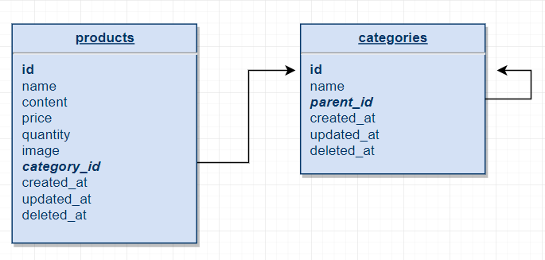 -->

Đây là cách thiết kế đơn giản nhất để chúng ta dễ dàng tiếp cận với kiến thức nhưng nó cũng là cách thiết kế yếu kém và khó mở rộng khi hệ thống phức tạp (Hệ thống quản lý sản phẩm Level 1).

Ví dụ khi công ty mở rộng, bán nhiều sản phẩm hơn (điện thoại, máy tính, đồ dùng gia dụng...). Với việc nhiều sản phẩm chủng loại khác nhau do đó có nhiều trường hơn cần được thêm vào như *color*, *size*, *weight*, *chip*, *ram*,... Và đó là lúc mà cấu trúc bảng như trên bộc lộ điểm yếu do khó mở rộng. Chúng ta thêm vài chục trường dữ liệu vào một bảng nhưng khi lấy dữ liệu chúng ta chỉ sử dụng một vài trường trong số đó, điều đó gây việc tốn tài nguyên không cần thiết. Do đó đây là lúc chúng ta cần sử dụng EAV Pattern (Hệ thống quản lý sản phẩm Level 2).

Khi chúng ta sử dụng EAV, cấu trúc bảng được chia ra như sau:
<!-- 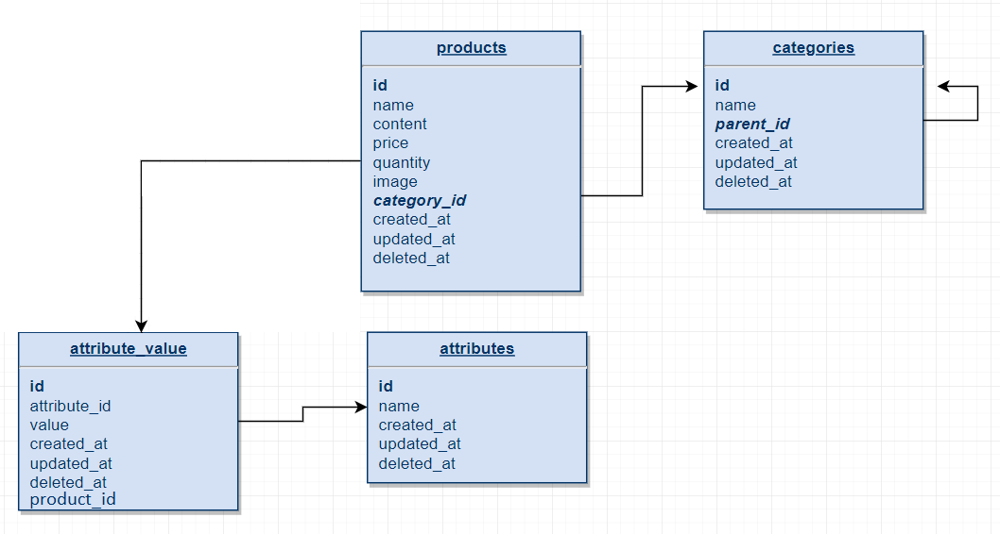 -->

Tất cả những thuộc tính mong muốn thêm thì giờ chúng ta có thể thêm từ trang quản trị mà không cần sửa lại cấu trúc database.

1. Thêm vào bảng **attributes** một record cho thuộc tính `color`:

```
id=1, name="color"
```

2. Thêm các giá trị của thuộc tính (value) và id sản phẩm tương ứng với giá trị đó (product_id) vào bảng **attribute_value**:

```
id = 1, attribute_id = 1, value = "Đỏ", product_id = 1
id = 2, attribute_id = 1, value = "Xanh Lam", product_id = 2
id = 3, attribute_id = 1, value = "Vàng", product_id = 7
id = 4, attribute_id = 1, value = "Trắng", product_id = 5
```

Như vậy, với cách thiết kế trên chúng ta thấy hệ thống của chúng ta đã động hơn nhiều rồi. Vấn đề thiết kế CSDL cho một hệ thống lớn là rất quan trọng, chúng ta có thể tham khảo cách thiết kê của các mã nguồn mở như Magento để từ đó có thể học hỏi thêm về tư duy thiết kế hệ thống, đặc biệt là thiết kế hệ thống thương mại điện tử.
